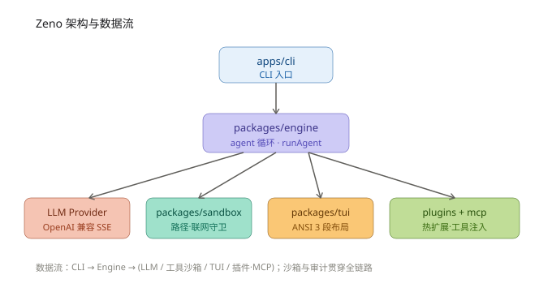

# Zeno


> **Terminal-first AI coding agent.** 多智能体协作 · 安全沙箱 · 单二进制 · 插件可扩展。

Zeno 把你 terminal 变成 AI 编程工作台。**Plan**（先规划再动手）或 **Vibe**（边聊边写），自然语言直接「合成」为代码改动。纯 TypeScript + `bun build --compile` → 一个 `dist/zeno` 二进制，零依赖开箱即用。

```bash
# 一行命令搞定
export ZENO_API_KEY="sk-..." && ./dist/zeno -g '给 src/core 写单元测试'
```

---

## 为什么选 Zeno？

| 特性 | 说明 |
| --- | --- |
| **单二进制** | ~60 MB，无 `node_modules`、无 wasm，`scp` 到服务器直接跑 |
| **双模式** | Plan（结构化规划 → 分步执行）/ Vibe（流式对话即时改动） |
| **安全第一** | 路径越界守卫 + 联网开关 + 5 维审计 + 插件信任门禁 |
| **可扩展** | MCP 协议接入外部工具 · 插件系统热扩展 · 工具注册表动态注入 |
| **极快冷启** | P95 = 30.5 ms（远低于 150 ms 交互基线） |
| **Terminal 原生** | 完整 ANSI TUI：多面板、语法高亮、命令面板、文件树、配置界面 |

---

## 快速上手

### 一行命令安装（推荐）

```bash
# macOS / Linux — 自动装 Bun、编译、装到 ~/.local/bin
curl -fsSL https://raw.githubusercontent.com/Agions/zeno/main/scripts/install.sh | bash

# Windows PowerShell
irm https://raw.githubusercontent.com/Agions/zeno/main/scripts/install.ps1 | iex
```

```bash
# 装完三步开跑
export ZENO_API_KEY="sk-..."
zeno                                # 交互 TUI — 全屏终端体验
zeno -g '给当前目录写一份 README.md'  # 无头模式 — 直接干活
```

### 源码构建

```bash
git clone git@github.com:Agions/zeno.git && cd zeno
bun install && bun run compile      # → dist/zeno
```

> **前置要求**：Bun >= 1.1、Git。Node.js >= 18 仅用于 `biome`/`turbo` 等辅助工具，非运行时依赖。更多方式（二进制分发 / 自定义目录 / 卸载）见 [安装指南](docs/guide/installation.md)。

---

## 配置

Zeno 采用**三级优先级**：命令行参数 > 环境变量 > 配置文件。

### 环境变量（主要方式）

| 变量 | 作用 | 默认值 | 必填 |
| --- | --- | --- | --- |
| `ZENO_API_KEY` | LLM API Key | — | **是** |
| `ZENO_MODEL` | 模型名 | `deepseek-v4-pro` | 否 |
| `ZENO_LLM_BASE_URL` | OpenAI 兼容端点 | `https://api.deepseek.com/v1` | 否 |
| `ZENO_MODE` | `plan` / `vibe` / `auto` | `vibe` | 否 |
| `ZENO_THEME` | `mocha`(默认) / `latte` / `neon` / `midnight` / `forest` / `light` | `mocha` | 否 |
| `ZENO_HARDEN` | OS 级硬隔离开关（`1`=开启 sandbox-exec/bwrap） | 关闭 | 否 |
| `ZENO_NET` | 联网开关（`0`=关闭） | 开启 | 否 |
| `ZENO_DATA_DIR` | 数据目录 | `~/.zeno` | 否 |
| `ZENO_AUDIT` | 审计日志（`1`=开启） | 关闭 | 否 |
| `ZENO_REPOMAP` | 仓库地图（`0`=关闭） | 开启 | 否 |

### 配置文件（可选便利层）

支持 `~/.zeno/config.json`（全局）和项目根 `zeno.json` / `.zenorc`（项目级），可配置 mode、model、theme 等非敏感项。**API Key 必须走环境变量，配置文件禁止写入。**

```json
// zeno.json（项目根）
{
  "mode": "plan",
  "model": "deepseek-v4-pro",
  "theme": "mocha",
  "sandbox": { "networkAllowed": false, "harden": true }
}
```

---

## 使用示例

### Plan 模式 — 先规划，再动手

```bash
./dist/zeno -m plan '实现用户认证模块：注册、登录、JWT 刷新'
```

Agent 先输出结构化执行计划，你确认后逐步实施，每步可审查回滚。

### Vibe 模式 — 边聊边写（默认）

```bash
./dist/zeno -g '把 utils 目录下所有函数加上 JSDoc 注释'
```

流式输出 + tool_calls，改动即时生效，适合探索式编程。

### TUI 速览

四区布局：聊天主区 + 常驻侧栏（`^B` 开关 / `^T` 切文件·任务·工具）+ 分屏输出流（`^O`）+ 浮窗命令面板（`/` 命令、`@` 文件引用）。`Tab` 切换 Vibe/Plan，`^P^N` 翻输入历史，`↑↓` 纯滚屏不碰输入框。全套快捷键与斜杠命令见 [TUI 使用指南](docs/guide/tui.md)。

### 加载插件

```bash
# 无头模式（-p 即授权，适合 CI/脚本）
./dist/zeno -g '用自定义工具处理数据' -p packages/plugins/examples/hello-plugin.ts

# TUI 模式（启动后弹出信任确认）
./dist/zeno -p packages/plugins/examples/hello-plugin.ts
```

> ⚠️ 插件在 Zeno 进程内执行，拥有同等权限。仅加载你完全信任的插件。

### 接入 MCP Server

```bash
# 接入 stdio MCP server（可重复 -s 接入多个）
./dist/zeno -g '查询天气' -s "npx -y @modelcontextprotocol/server-xxx"

# 自建 MCP server
./dist/zeno -g '用自定义工具' -s "bun run packages/mcp/examples/echo-server.ts"
```

> MCP server 以子进程启动（stdio JSON-RPC，协议版本 2024-11-05），工具自动并入 agent 工具集，走同一套沙箱/审计链路。

---

## 功能矩阵

| 功能 | 说明 | 状态 |
| --- | --- | --- |
| 单二进制 | Bun compile 打包，零外部依赖 | ✅ MVP |
| 双模式 TUI | 交互式 ANSI 终端 / 无头流式输出 | ✅ MVP |
| Agent 循环 | 流式 token + tool_calls + 回填，maxSteps=8 | ✅ MVP |
| 内置工具 | read_file / write_file / run_shell，经 sandbox 守卫 | ✅ MVP |
| LLM 兼容 | DeepSeek 端点，OpenAI 兼容 SSE 均可接入 | ✅ MVP |
| 插件系统 | `-p/--plugin` 动态加载，工具注册表热扩展 | ✅ MVP |
| 沙箱守卫 | safeResolve 越界拦截 + 网络开关 | ✅ MVP |
| MCP 接入 | `-s/--mcp` 接入 stdio JSON-RPC server | ✅ v0.1.0 |
| TUI 内插件 | 交互界面加载 + 信任确认门禁 | ✅ v0.1.0 |
| 配置体系 | 环境变量 + config.json + zeno.json 三级优先级 | ✅ v0.1.0 |
| 5 维审计 | 工具调用 / 文件 / 网络 / 配置 / 插件全链路 | ✅ v0.1.0 |
| OS 硬隔离 | bubblewrap(Linux 推荐) / seatbelt(macOS 15+ 需 root)；`ZENO_HARDEN=1` 或 `sandbox.harden`，不可用时 Fail-Closed | ✅ v0.1.0 |

---

## 架构概览

自然语言目标（goal）→ `engine` 的 agent 循环 → LLM 流式补全 → 工具调用 → `sandbox` 执行 → TUI / 无头渲染。整条链由 `bun build --compile` 打包为单二进制。



> 更完整的模块职责、数据流与不变量见 [架构总览](docs/architecture/index.md)（含 mermaid 版与交互说明）。

---

## 目录结构

```
zeno/
├── apps/
│   └── cli/                      # CLI 入口（bin: zeno）
├── packages/
│   ├── core/                     # 共享类型 · 配置 · 错误 · 事件总线 · 日志
│   ├── engine/                   # LLM 客户端 · 工具系统 · agent 循环
│   ├── tui/                      # ANSI 渲染器 · 主题 · 组件库 · 逃生舱
│   ├── sandbox/                  # fs 越界守卫 · 命令执行 · 网络开关
│   ├── mcp/                      # MCP 客户端（stdio JSON-RPC）
│   ├── plugins/                  # 插件加载 · 生命周期 · 信任模型
│   └── harness/                  # 集成测试 / e2e 驱动
├── docs/                         # 项目文档
├── scripts/                      # 开发脚本 · 基准测试
├── dist/                         # 编译输出
├── package.json
├── pnpm-workspace.yaml
├── turbo.json
└── biome.json
```

---

## 文档导航

| 文档 | 受众 | 说明 |
| --- | --- | --- |
| [安装指南](docs/guide/installation.md) | 新用户 | 快捷脚本 / 源码 / 二进制分发、平台矩阵 |
| [快速开始](docs/guide/getting-started.md) | 新用户 | API Key、首次运行、插件与 MCP |
| [TUI 使用指南](docs/guide/tui.md) | 全体用户 | 四区布局、快捷键、斜杠命令、主题 |
| [配置详解](docs/guide/configuration.md) | 全体用户 | 环境变量与配置文件完整参考 |
| [插件开发](docs/guide/plugins.md) | 插件开发者 | manifest、生命周期、工具注册 |
| [架构总览](docs/architecture/index.md) | 架构师 / 贡献者 | 模块关系、数据流、关键不变量 |
| [Package 职责](docs/architecture/packages.md) | 贡献者 | 各 `@zeno/*` 包职责与入口 |
| [API 参考](docs/api/overview.md) | 用户 / 开发者 | CLI 参数、退出码 |
| [开发规范](docs/development/dev-guide.md) | 贡献者 | 分支模型、代码规范、安全红线 |
| [贡献指南](docs/development/contributing.md) | 贡献者 | PR 规范、评审标准 |
| [测试指南](docs/development/testing.md) | 贡献者 | 测试策略、基准测试、覆盖率 |
| [FAQ](docs/faq/index.md) | 全体用户 | 常见问题与故障排查 |
| [变更日志](docs/changelog/v0.1.0.md) | 全体用户 | 版本历史与迁移指南 |

---

## 阅读路径

### 🟢 入门（15 分钟）

1. [为什么选 Zeno？](#为什么选-zeno)
2. [快速上手](#快速上手)
3. [使用示例](#使用示例)

### 🟡 进阶（30 分钟）

1. [配置详解](docs/guide/configuration.md)
2. [插件开发](docs/guide/plugins.md)
3. [FAQ](docs/faq/index.md)

### 🔴 深入（2 小时+）

1. [架构总览](docs/architecture/index.md)
2. [开发规范](docs/development/dev-guide.md)
3. [贡献指南](docs/development/contributing.md)
4. [测试指南](docs/development/testing.md)

---

## 贡献

欢迎 PR！请先阅读 [贡献指南](docs/development/contributing.md)，了解分支模型、Conventional Commits、测试策略与安全红线（密钥扫描、体积门禁）。

---

## 许可证

[MIT](./LICENSE) © 2026 Agions
