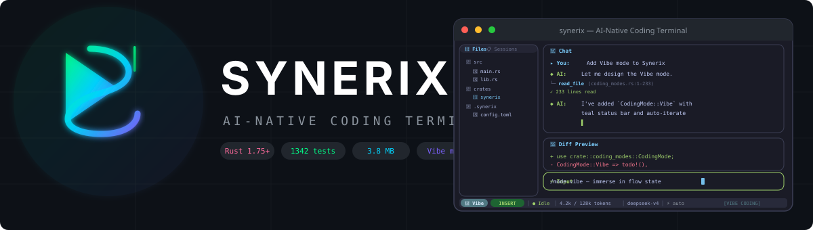
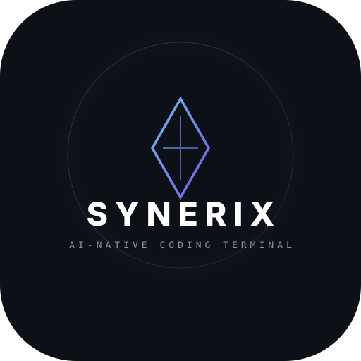

<p align="center">
  
</p>

<p align="center">
  <strong>⚡ Synerix</strong> — 用 Rust 编写的高性能 AI 编码终端
</p>

<p align="center">
  <a href="https://github.com/Agions/synerix/actions/workflows/ci.yml"></a>
  <a href="LICENSE"></a>
  <a href="https://www.rust-lang.org"></a>
  
  
  
</p>

<p align="center">
  融合 <a href="https://docs.anthropic.com/en/docs/agents-and-tools/claude-code">Claude Code</a> 的交互体验、
  <a href="https://github.com/openai/codex">Codex CLI</a> 的沙箱安全、
  <a href="https://github.com/opencode-ai/opencode">OpenCode</a> 的可扩展架构<br>
  多智能体协作 · MCP 协议 · 工作流引擎 · 安全沙箱 · 流式推理
</p>

---

## ✨ 特性一览

<table>
<tr>
<td width="50%">

### 🤖 多智能体协作
Agent Swarm 架构，5 种角色协同工作：
- **Coder** — 编写和修改代码
- **Reviewer** — 代码审查
- **Tester** — 编写和运行测试
- **Architect** — 架构设计
- **Planner** — 任务分解

流式推理 → 工具分发 → 并行执行 → 多轮推理

</td>
<td width="50%">

### 🔧 工作流引擎
YAML 定义多步骤 DAG 流水线：
- 依赖解析 + 条件分支
- 变量插值 + 自动重试
- 内置 code-review / refactor / debug
- 自定义工作流一键执行

```bash
synerix --workflow workflows/code-review.yaml
```

</td>
</tr>
<tr>
<td>

### 🎨 极致 TUI 体验
ratatui 五区布局，Tokyo Night 暗色主题：
- 流式打字效果 + 思考动画
- syntect 语法高亮 Diff 视图
- **Vim** / **Emacs** / 默认键位
- 完整鼠标支持

</td>
<td>

### 🔒 安全沙箱
多层安全机制保护你的代码：
- 命令风险分级（安全/中等/危险）
- 原子文件写入（崩溃安全）
- 审批流程（自动/确认/仅预览）
- MCP 工具权限隔离

</td>
</tr>
<tr>
<td>

### 🧩 可扩展架构
插件化设计，按需扩展：
- **Skills** — YAML/MD 技能文件自动匹配
- **MCP** — 原生支持 stdio/HTTP 传输
- **Plugins** — 完整生命周期管理
- **Custom Agents** — TOML/YAML 自定义智能体

</td>
<td>

### ⚡ 极致性能
Rust 零成本抽象，为速度而生：
- 启动 **2ms**（目标 <80ms）
- 二进制 **3.8MB**（目标 ≤15MB）
- LTO + strip + codegen-units=1
- Token 预算 + LRU 缓存 + 零拷贝

</td>
</tr>
</table>

## 📦 安装

```bash
# curl 一键安装（推荐）
curl -fsSL https://raw.githubusercontent.com/Agions/synerix/main/install.sh | bash

# 自定义安装目录
INSTALL_DIR=~/.local/bin curl -fsSL https://raw.githubusercontent.com/Agions/synerix/main/install.sh | bash
```

<details>
<summary>从源码构建</summary>

```bash
git clone https://github.com/Agions/synerix.git
cd synerix
cargo build --release
# 二进制位于 target/release/synerix
```
</details>

<details>
<summary>卸载</summary>

```bash
# 一键卸载（保留配置）
curl -fsSL https://raw.githubusercontent.com/Agions/synerix/main/uninstall.sh | bash

# 完全卸载（包括配置和数据）
curl -fsSL https://raw.githubusercontent.com/Agions/synerix/main/uninstall.sh | bash -s -- --all
```
</details>

## 🚀 快速开始

### 1. 配置 LLM

```bash
mkdir -p ~/.config/synerix
cat > ~/.config/synerix/config.toml << 'EOF'
[llm]
provider = "deepseek"       # deepseek | mimo | custom
api_key = "your-api-key"
model = "deepseek-chat"
context_window = 128000
max_output_tokens = 8192

[ui]
theme = "dark"              # dark | light
keymap = "default"          # vim | emacs | default

[sandbox]
mode = "confirm"            # auto | confirm | preview_only
atomic_writes = true
EOF
```

### 2. 启动

```bash
synerix
```

### 3. 开始编码

```
❯ 请帮我重构这个函数，提升可读性
```

## ⌨️ 键位映射

<details>
<summary>Vim 模式</summary>

| 模式 | 按键 | 功能 |
|:---:|------|------|
| 普通 | `i` / `a` / `A` | 进入插入模式 |
| 普通 | `:` / `/` | 命令模式 / 搜索模式 |
| 普通 | `j` / `k` | 向下 / 向上滚动 |
| 普通 | `G` / `gg` | 滚动到底部 / 顶部 |
| 普通 | `dd` / `yy` / `p` | 清除行 / 复制 / 粘贴 |
| 插入 | `Esc` | 返回普通模式 |
| 插入 | `Ctrl+w` | 删除单词 |
| 插入 | `Ctrl+k` / `Ctrl+u` | 删除到行尾 / 行首 |
</details>

<details>
<summary>Emacs 模式</summary>

| 按键 | 功能 |
|------|------|
| `Ctrl+n` / `Ctrl+p` | 向下 / 向上滚动 |
| `Ctrl+f` / `Ctrl+b` | 光标右移 / 左移 |
| `Ctrl+a` / `Ctrl+e` | 跳到行首 / 行尾 |
| `Ctrl+k` / `Ctrl+y` | 删除 / 粘贴 |
</details>

## 🤖 多智能体与工作流

### 内置智能体角色

| 角色 | 职责 | 能力 |
|------|------|------|
| **Coder** | 编写和修改代码 | 读写文件、执行命令、运行测试 |
| **Reviewer** | 代码审查 | 只读文件、搜索代码 |
| **Tester** | 编写和运行测试 | 读写文件、执行命令 |
| **Architect** | 架构设计 | 只读文件、搜索代码 |
| **Planner** | 任务分解和规划 | 无工具权限 |

### 内置工作流

| 工作流 | 流程 | 说明 |
|--------|------|------|
| **code-review** | Coder → Reviewer → Tester | 自动化代码审查 |
| **refactor** | Architect → Coder → Reviewer | 结构化重构 |
| **debug** | Tester → Coder → Tester | 系统化调试 |

### 自定义工作流

```yaml
name: my-workflow
description: 自定义工作流
version: "1.0"

variables:
  language: Rust

steps:
  - id: step1
    agent_role: coder
    prompt: "用 {{language}} 实现：{{task}}"
    output_variable: code
    timeout_secs: 300

  - id: step2
    agent_role: reviewer
    prompt: "审查代码：{{code}}"
    depends_on: [step1]
    output_variable: feedback
```

## 🔌 配置

### LLM 提供商

| 提供商 | 模型 | 说明 |
|--------|------|------|
| `deepseek` | deepseek-chat | DeepSeek V4（默认） |
| `mimo` | mimo-v2.5 | 小米 MiMo |
| `custom` | 任意 | 任意 OpenAI 兼容 API |

### 环境变量覆盖

| 变量 | 说明 |
|------|------|
| `SYNERIX_API_KEY` | LLM API 密钥 |
| `SYNERIX_BASE_URL` | API 基础 URL |
| `SYNERIX_MODEL` | 模型标识符 |

### MCP 服务器

```toml
# stdio 传输（本地进程）
[[mcp]]
name = "gitee"
type = "stdio"
command = "npx"
args = ["-y", "@gitee/mcp-gitee"]
auto_reconnect = true
timeout_secs = 30

[mcp.env]
GITEE_TOKEN = "your-token"

# HTTP 传输（远程服务器）
[[mcp]]
name = "remote-tools"
type = "http"
url = "https://mcp.example.com/sse"
timeout_secs = 60
```

### 外部技能来源

```toml
# 本地目录
[[skill_sources]]
type = "local"
location = "~/.config/synerix/skills"

# Git 仓库（自动克隆+更新）
[[skill_sources]]
type = "git"
location = "https://gitee.com/Agions/synerix-skills.git"
branch = "main"
include = ["**/*.md"]
```

### 自定义智能体

```toml
[[agents]]
name = "security-auditor"
description = "安全审计专家"
system_prompt = "你是安全审计专家，专注于漏洞检测..."
tools = ["file_read", "search"]
max_turns = 8
tags = ["security"]
```

## 🏗️ 架构

```
src/
├── main.rs                 # 入口 + 启动计时
├── app.rs                  # 应用状态机 + 事件分发
├── error.rs                # 统一错误类型 (thiserror)
├── config/                 # 配置层
│   ├── settings/           # TOML 配置 + 环境变量覆盖
│   ├── keymap/             # Vim/Emacs 键位配置
│   └── watcher.rs          # 配置热重载 (mtime + SIGHUP)
├── tui/                    # TUI 渲染层
│   ├── theme.rs            # Tokyo Night 亮暗主题
│   ├── frame.rs            # 五区布局渲染
│   ├── diff_renderer.rs    # syntect Diff 高亮
│   ├── syntax.rs           # 代码高亮引擎
│   └── widgets/            # 7 个可组合 UI 组件
├── llm/                    # LLM 适配层
│   ├── adapter.rs          # LLM 适配器 trait
│   ├── stream.rs           # SSE 流解析器
│   └── types.rs            # 统一 LLM 类型
├── agent/                  # 智能体层
│   ├── agloop.rs           # 核心智能体循环
│   ├── context.rs          # Token 预算 + 动态裁剪
│   ├── prompt.rs           # 系统提示词构建
│   └── multi/              # 多智能体协作
├── tools/                  # 工具层
│   ├── registry.rs         # 工具注册中心
│   └── builtin/            # 5 个内置工具
├── skills/                 # 技能层
│   ├── registry.rs         # 技能注册中心
│   ├── loader.rs           # YAML frontmatter 解析
│   └── builtin/            # 内置技能
├── mcp/                    # MCP 协议层
│   ├── client.rs           # MCP 客户端
│   ├── manager.rs          # 多服务器管理器
│   └── transport.rs        # 传输 trait
├── sandbox/                # 安全沙箱
│   ├── command_preview.rs  # 风险分级
│   ├── atomic_replace.rs   # 崩溃安全写入
│   └── approval.rs         # 审批流程
├── workflow/               # 工作流引擎
│   ├── definition.rs       # YAML 工作流定义
│   ├── runner/             # 执行器
│   └── builtin.rs          # 内置工作流
└── session/                # 会话持久化
    ├── store.rs            # SQLite 持久化
    └── model.rs            # 会话/消息模型
```

## 🧪 测试

```bash
# 运行全部测试（1149 个测试）
cargo test

# 运行特定测试套件
cargo test --lib                    # 单元测试
cargo test --test e2e               # 端到端测试
cargo test --test phase2            # 工具 + 沙箱
cargo test --test phase3            # 主题 + Diff + 语法高亮
cargo test --test phase4            # 键位 + 鼠标
cargo test --test full_pipeline     # 完整流水线测试
cargo test --test workflow_integration  # 工作流集成测试

# 启动性能基准
cargo run --features startup_bench
```

## 🛠️ 开发

```bash
# 类型检查
cargo check

# 格式化
cargo fmt

# 静态分析
cargo clippy -- -D warnings -A dead_code

# Release 构建（LTO + strip）
cargo build --release
```

## 📊 技术栈

| 组件 | 选型 | 版本 |
|------|------|------|
| 语言 | Rust | 1.75+ |
| TUI | ratatui + crossterm | 0.28 |
| 异步运行时 | tokio | 1.x |
| HTTP 客户端 | reqwest | 0.12 |
| 数据库 | rusqlite (bundled) | 0.31 |
| 语法高亮 | syntect | 5.x |
| 错误处理 | thiserror | 2.x |
| 配置解析 | toml | 0.8 |
| 日志 | tracing | 0.1 |

## 📈 性能指标

| 指标 | 目标 | 实际 | 状态 |
|------|------|------|:----:|
| 启动速度 | <80ms | **2ms** | ✅ |
| 二进制大小 | ≤15MB | **3.8MB** | ✅ |
| 测试数量 | — | **1149** | ✅ |
| 生产 unwrap | 0 | **0** | ✅ |
| unsafe 代码 | 0 | **0** | ✅ |
| 编译警告 | 0 | **0** | ✅ |

## 🤝 贡献

欢迎贡献！请遵循以下步骤：

1. Fork 本仓库
2. 创建功能分支 (`git checkout -b feature/amazing-feature`)
3. 提交更改 (`git commit -m 'feat: add amazing feature'`)
4. 推送到分支 (`git push origin feature/amazing-feature`)
5. 创建 Pull Request

### 提交规范

| 前缀 | 说明 |
|------|------|
| `feat:` | 新功能 |
| `fix:` | Bug 修复 |
| `docs:` | 文档更新 |
| `refactor:` | 代码重构 |
| `test:` | 测试相关 |
| `chore:` | 构建/工具相关 |

## 📄 开源协议

本项目采用 [MIT License](LICENSE) 开源。

---

<p align="center">
  <br><br>
  <strong>Synerix</strong> — AI-Native Coding Terminal<br>
  <sub>用 Rust 编写，为速度而生</sub>
</p>
