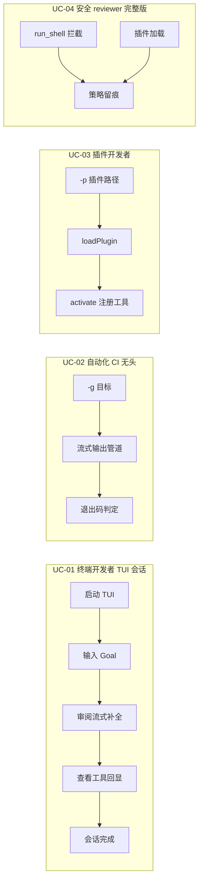
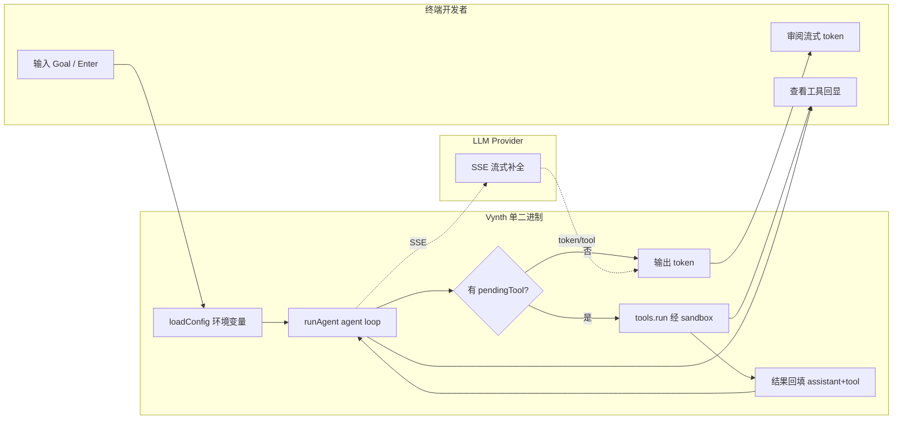
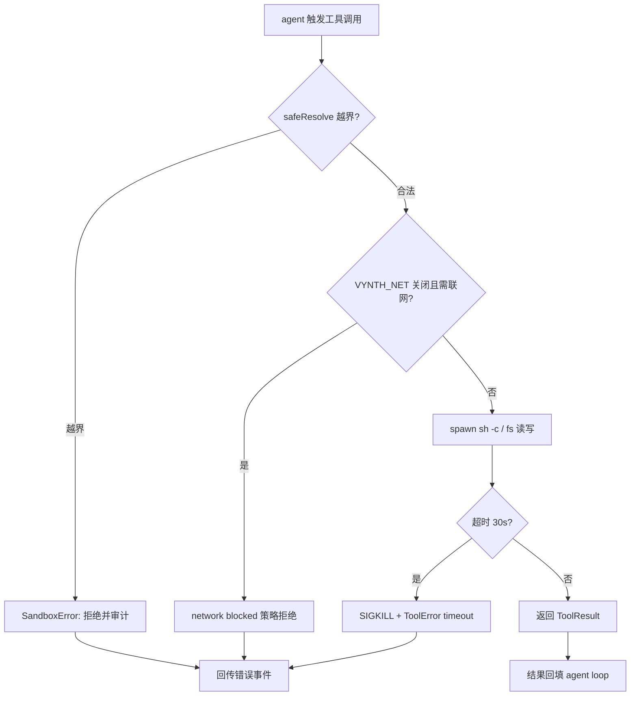
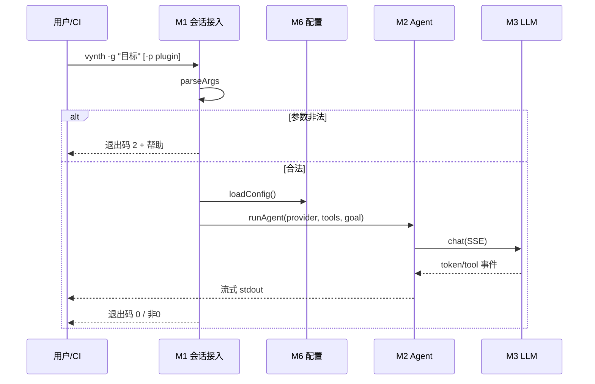
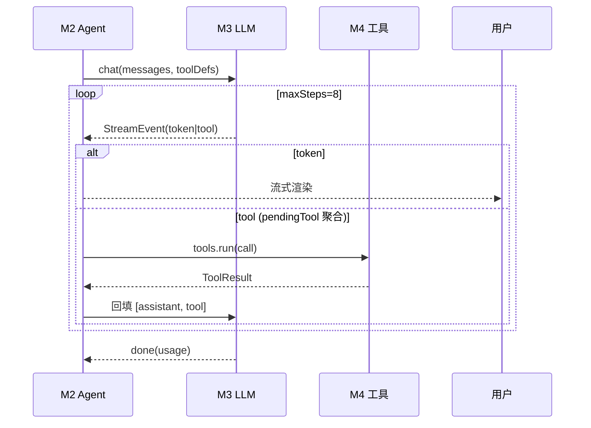
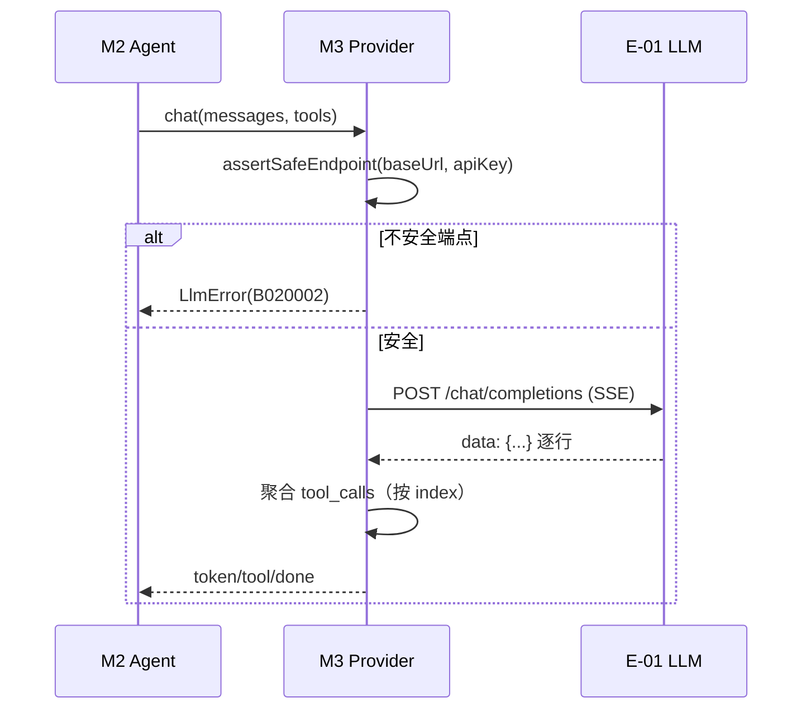
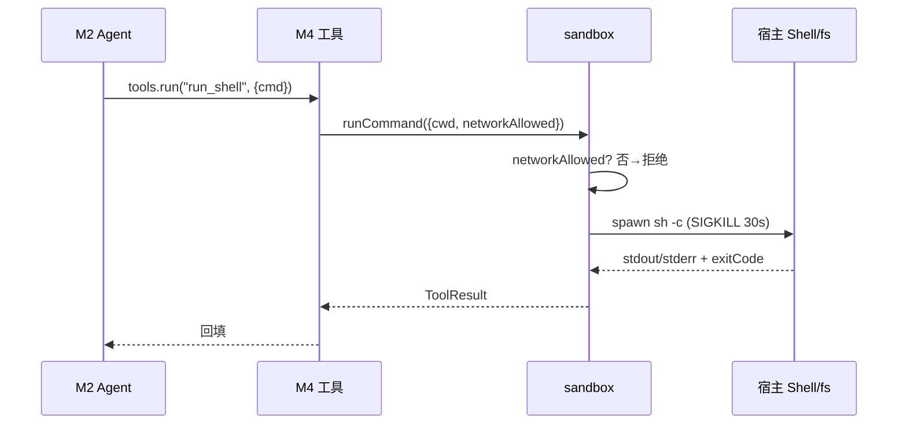
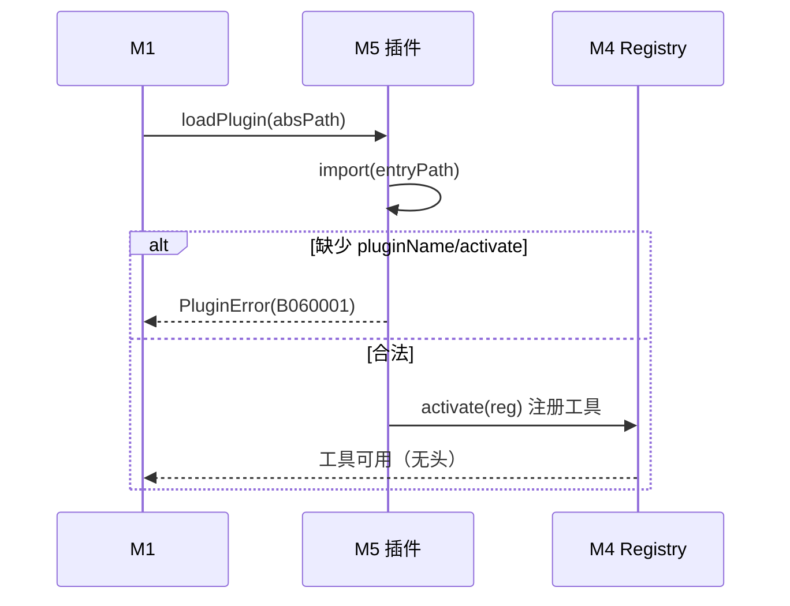
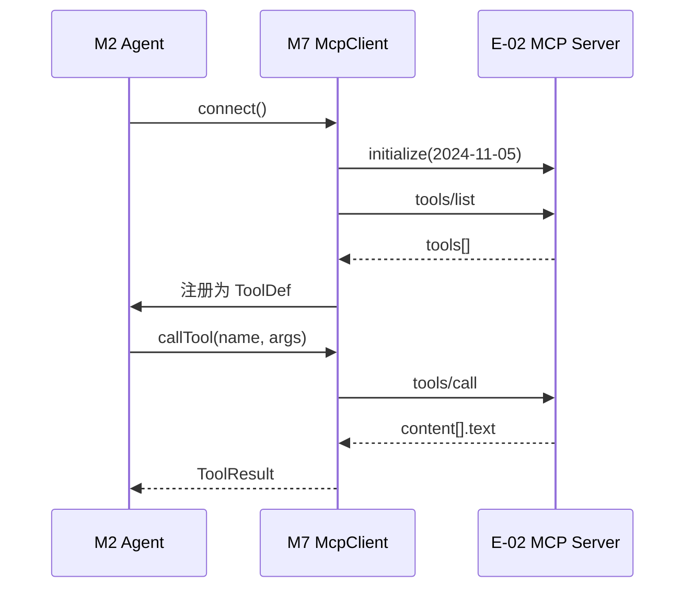
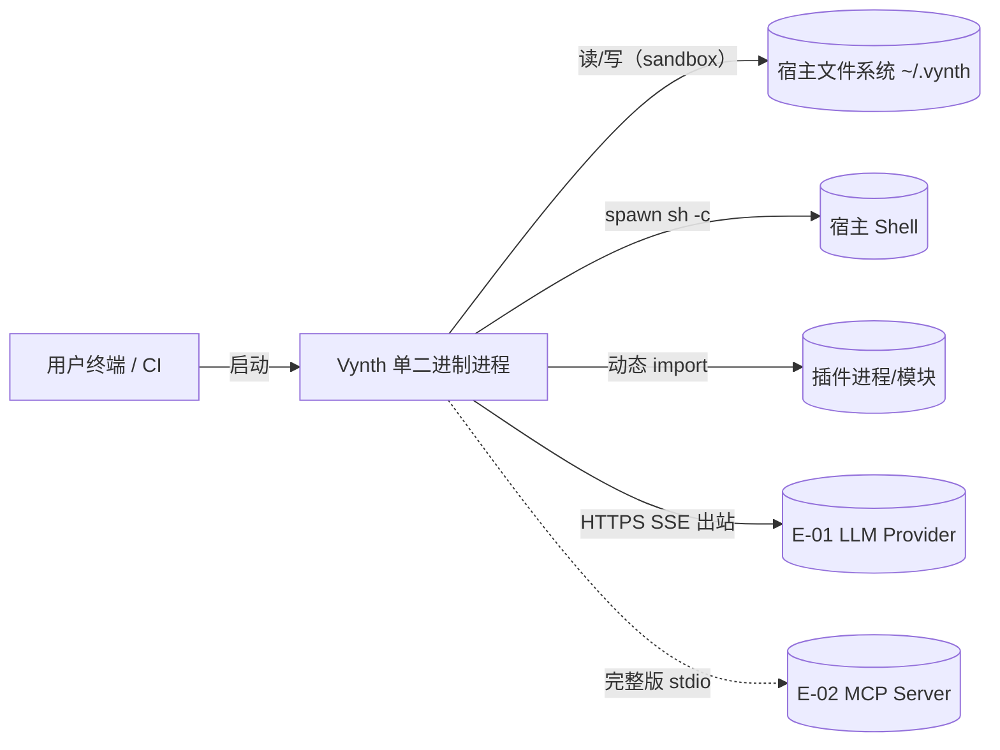

# AICoding 架构设计 · 系统设计

> 本文档为《AICoding 架构设计》核心产物之一，对应**系统架构设计模版**。
> 上游输入：《高层架构设计》v0.1（G3 已审核通过，方案 A：MVP 沙箱推迟至完整版）产出的业务架构、系统定位、能力盘点、MVP / 完整版边界；
> 下游输出：用于驱动《部署设计》《安全设计》《UserStory》的实施。
> 本文档为 **G4 系统设计**阶段唯一 Owner（system-architect / 高见远）产出，所有模块、领域划分、接口边界、数据设计均可回溯到《高层架构设计》对应章节。

> **适配说明（本地优先单二进制形态）**：本系统为本地优先、单二进制的 vibe coding TUI 终端编程工具，非 SaaS、非云端后端、非多租户（冻结于《高层架构设计》§4.2）。因此模板中面向"云 SaaS / 多租户 / 集群"的章节（如多租户隔离字段、K8s、VPC、云中间件）已按本地优先形态做等价适配并在对应章节注明，不引入与上游定位冲突的云服务依赖。

---

## 0. 元信息：修订记录

| 文档版本 | 发布日期 | 修订人 | 修订说明 |
| --- | --- | --- | --- |
| v1.0 | 2026-07-25 | 高见远（system-architect） | 初稿（G4 系统设计，基于《高层架构设计》v0.1 边界冻结） |

**填写要求**：每次评审通过新增一行；修订说明必须能定位到具体章节。

**未启用章节声明**：
- §4.5 数据迁移与兼容性：本项目为全新系统（无存量数据迁移），整节略过，详见 §4.5 占位说明。
- §3.4 跨模块公共能力：保留，登记横切 SDK / 切面能力。

---

## 1. 引言

### 1.1 文档目标

- **一句话定位**：本文档定义 Vynth（本地优先单二进制 vibe coding TUI 工具）在交付物中的所有架构设计相关产物。
- **读者对象**：架构师 / 开发 / 运维 / 安全 / 评审委员会。
- **设计范围**：业务架构 + 应用架构 + 数据库设计 + 部署架构 + 网络架构 + 安全设计（设计级选择）+ 可观测设计。

### 1.2 关联文档清单

| 输入类型 | 内容要点 | 在本文档中的用途 | 形式（外部文档 / 本文档自带） |
| --- | --- | --- | --- |
| 业务需求 | 系统定位（本地优先单二进制）、角色（终端开发者 / 自动化 CI / 插件开发者 / 安全 reviewer）、场景、MVP 范围 F1–F11、完整版 F12–F15 | 第 2 章业务架构 | 外部文档《高层架构设计》§1–§6 |
| 非功能性需求 | 冷启动 P95 ≤ 150ms、单二进制体积 ≤ 61MB（MVP）/ ≤ 40MB（完整版）、仅 7 个环境变量、高危操作审计（完整版） | 第 2.5 / 3.5 / 5 / 7 / 8 章 | 外部文档《高层架构设计》§1.3 / §6.1 |
| 系统定位与边界 | 本地优先单二进制、不做云端后端 / 多租户 SaaS / 厂商锁定模型 | 第 3.1 / 5 / 6 章 | 外部文档《高层架构设计》§4.2 / §6.1 |
| 外部系统 API | LLM Provider（OpenAI 兼容 SSE，默认 DeepSeek）、MCP Server（完整版，stdio JSON-RPC 2024-11-05） | 第 3.1.3 / 3.2 模块 | 外部文档《高层架构设计》§5.2；本文档 §3.1.3（E-xx） |
| 云组件 / 中间件清单 | 本地运行底座（SQLite 会话持久化、本地文件系统、进程内事件总线）；无云端中间件 | 第 3.1.3 / 4.3 章 | 本文档自带（C-xx 本地运行依赖） |
| 团队 / 行业规范 | 纯 TS 单二进制、仅环境变量配置、Bun 运行时、ADR-0003 | 第 4.1 / 5 / 7 章 | 外部文档 material_digest §D52 / D14 |

### 1.3 名词与术语表

| 业务术语 | 业务定义（≤ 30 字） | 应用层核心对象（§3.3 O-xx） | 数据库表名（§4.2） |
| --- | --- | --- | --- |
| 会话 / Session | 一次 TUI 或无头模式的 agent 交互过程 | `Session`（O-01） | `t_session` |
| 目标 / Goal | 用户输入的自然语言编程目标 | `Goal`（O-02，值对象） | `t_session.goal` |
| 工具调用 / ToolCall | agent 触发的 read/write/shell/插件工具执行 | `ToolCall`（O-03） | `t_tool_call` |
| 流式事件 / StreamEvent | 跨层唯一协议：token / tool / done | `StreamEvent`（O-04，值对象） | — |
| 沙箱策略 / SandboxPolicy | 越界守卫 + VYNTH_NET 软开关（MVP）；OS 级硬隔离（完整版） | `SandboxPolicy`（O-05，值对象） | — |
| 安装标识 / InstallId | 本地单租户上下文标识，持久化于 ~/.vynth/install_id | `installId`（O-06，值对象） | `install_id`（等价 tenant_id） |
| 插件 / Plugin | 通过 -p 动态 import 加载并注册工具（无头） | `Plugin`（O-07） | — |
| 信任模型 | 宿主权限执行；MVP 设计信任，完整版硬隔离 | `TrustModel`（O-08，值对象） | — |

---

## 2. 业务架构

> **本章回答**：系统服务什么业务、业务由哪些场景构成、业务的关键流程长什么样。

### 2.1 业务架构概览

#### 2.1.1 业务全景图

**业务域清单**（6 个，与第 3 章模块、第 4 章数据库分组一致）：

| 业务域 | 核心场景 | 涉及角色 | 与其他业务域的关系 |
| --- | --- | --- | --- |
| D1 会话交互域 | TUI 交互 / 无头执行 / agent loop 编排 | 终端开发者、自动化 CI | 下游消费 D2/D3/D4/D5；上游依赖 D5 配置 |
| D2 智能推理域 | LLM 流式补全 / tool_calls 聚合 / Provider 抽象 | 终端开发者 | 被 D1 消费；ACL 对接外部 LLM |
| D3 工具执行域 | read_file / write_file / run_shell 经 sandbox 执行 | 终端开发者 | 被 D1 消费；为 D4 提供工具注册契约 |
| D4 扩展域 | 插件无头接入（MVP）、MCP CLI 接入（完整版） | 插件开发者、终端开发者 | 依赖 D3 工具契约；完整版 Conformist 对接 MCP |
| D5 配置与基座域 | 环境变量配置 / 事件总线 / 日志 / 错误体系 | 全部角色（透明） | Shared Kernel 被 D1–D4/D6 共享 |
| D6 安全信任域 | 越界守卫 / VYNTH_NET 软开关 / 高危操作审计（完整版） | 企业安全 reviewer | 横切 D1–D4；MVP 软隔离，完整版 OS 级 |

### 2.2 领域关系映射

#### 2.2.1 限界上下文清单

| 限界上下文 | 对应业务域 | 域类型 | 覆盖的核心业务实体 | 上下文边界（属于本域 vs 不属于） |
| --- | --- | --- | --- | --- |
| BC-Session | D1 会话交互域 | 核心域 | Session / Goal / AgentLoop / Mode | 属于：会话生命周期、渲染路由；不属于：LLM 调用细节（归 BC-LLM） |
| BC-LLM | D2 智能推理域 | 核心域 | Provider / ChatMessage / ToolCall(聚合) | 属于：SSE 解析、tool_calls 聚合；不属于：外部 Provider 协议细节（经 ACL） |
| BC-Tool | D3 工具执行域 | 核心域 | ToolDef / ToolResult / SandboxPolicy | 属于：工具执行、越界守卫；不属于：LLM（归 BC-LLM）、插件加载（归 BC-Ext） |
| BC-Ext | D4 扩展域 | 支撑域 | Plugin / McpClient（完整版） | 属于：插件加载、MCP 适配；不属于：工具实现（归 BC-Tool） |
| BC-Core | D5 配置与基座域 | 通用域 | Config / Event / LogEntry / VynthError | 属于：配置、事件、日志、错误；不属于：业务逻辑 |
| BC-Sec | D6 安全信任域 | 支撑域 | TrustModel / AuditRecord（完整版） | 属于：沙箱策略、审计留痕；不属于：业务功能 |

**域类型说明**：核心域（BC-Session / BC-LLM / BC-Tool）为差异化竞争力，投入最多自研；支撑域（BC-Ext / BC-Sec）必要但非差异化；通用域（BC-Core）优先复用现有 `@vynth/core` 底座。

#### 2.2.2 上下文映射（Context Mapping）

| 关系编号 | 上游上下文 | 下游上下文 | 关系模式 | 同步方式 | 选择理由 |
| --- | --- | --- | --- | --- | --- |
| C-01 | BC-LLM | BC-Session | Customer/Supplier | 进程内函数调用 + AsyncIterable 流式 | Session 是 LLM 的消费者（Customer），LLM 按 Session 的 tool_calls 需求聚合输出（Supplier），双方强协作 |
| C-02 | 外部 LLM Provider（DeepSeek/OpenAI） | BC-LLM | ACL 防腐层 | HTTPS SSE + `assertSafeEndpoint` 适配器 | 外部模型协议不污染本域；OpenAI 兼容 SSE 在 `llm.ts` 内隔离，未来换 Provider 不影响 BC-Session |
| C-03 | BC-Core | BC-Session / BC-LLM / BC-Tool / BC-Ext / BC-Sec | Shared Kernel | 进程内 import 共享 DTO | 配置 / 事件 / 日志 / 错误为跨域稳定概念，共享 `@vynth/core` 包，必须一致 |
| C-04 | 外部 MCP Server | BC-Ext（完整版） | Conformist | stdio JSON-RPC 2024-11-05 | MCP 协议由规范固定，Vynth 顺从协议（无议价权），完整版按规范实现 `tools/list`/`tools/call` |
| C-05 | BC-Tool | BC-Ext（插件） | Published Language | `ToolRegistry` 契约（ToolDef 结构） | BC-Tool 以 `ToolDef`/`ToolResult` 作为公开契约（Published Language），插件据此实现并注册工具，多插件共同消费 |

**关系模式说明**：五种模式（Customer/Supplier、ACL、Shared Kernel、Conformist、Published Language）齐备，覆盖内部协作、外部对接、跨域共享、协议顺从、契约发布五类关系。

#### 2.2.3 跨域协作原则

| 原则编号 | 原则 |
| --- | --- |
| P-01 | 核心域（BC-Session / BC-LLM / BC-Tool）→ 支撑域 / 通用域：禁止反向依赖（核心域不依赖 BC-Ext / BC-Sec 的内部模型） |
| P-02 | 核心域之间：禁止直接耦合，必须通过 StreamEvent / ToolRegistry 契约解耦（BC-LLM 仅以 AsyncIterable 暴露事件，BC-Tool 仅以 ToolDef 暴露能力） |
| P-03 | 对接外部不可控系统（LLM Provider / MCP Server）：必须建 ACL 防腐层（C-02 / C-04），禁止把外部模型贯穿到本域 |

### 2.3 详细业务架构

#### 2.3.1 用例图

**用例图清单**：

| 编号 | 用例图标题 | 涉及业务域 | 源文件位置 |
| --- | --- | --- | --- |
| UC-01 | 终端开发者 - TUI 会话编程 | D1 / D2 / D3 | 本文档 §2.3.1（Mermaid 内嵌） |
| UC-02 | 自动化 CI - 无头管道执行 | D1 / D2 / D3 / D4 | 本文档 §2.3.1（Mermaid 内嵌） |
| UC-03 | 插件开发者 - 无头插件注入 | D4 / D3 | 本文档 §2.3.1（Mermaid 内嵌） |
| UC-04 | 安全 reviewer - 高危操作审计（完整版） | D6 / D3 | 本文档 §2.3.1（Mermaid 内嵌） |



#### 2.3.2 业务流程图

**关键流程清单**（核心业务覆盖度 ≥ 80%）：

| 流程编号 | 流程名 | 起点 | 终点 | 涉及业务域 | 源文件位置 |
| --- | --- | --- | --- | --- | --- |
| BF-01 | TUI 会话主链路 | 启动 TUI（loadConfig） | 会话完成（done） | D1 / D2 / D3 / D5 | 本文档 §2.3.2（Mermaid 泳道） |
| BF-02 | 无头管道执行 | `-g` 入口 | 退出码 0/2/非 0 | D1 / D2 / D3 / D4 | 本文档 §2.3.2 |
| BF-03 | 工具执行与沙箱守卫 | agent 触发工具 | 工具结果回填 | D3 / D6 | 本文档 §2.3.2 |
| BF-04 | 插件无头接入 | `-p` 参数 | 工具注册完成 | D4 / D3 | 本文档 §2.3.2 |

**BF-01 TUI 会话主链路（角色泳道图）**：



**BF-03 工具执行与沙箱守卫（含异常分支）**：



**会话生命周期状态机（图）**：


### 2.4 业务范围与边界

#### 2.4.1 功能模块清单

| 编号 | 一级功能名 | 子功能描述 | 对应业务域 | 实现状态 |
| --- | --- | --- | --- | --- |
| F1 | 单二进制分发 | Bun compile 单二进制；`--version` / `--help` | D1 | 完整实现 |
| F2 | TUI 渲染 | 自研 ANSI + 流式逃生舱 | D1 | 完整实现 |
| F3 | 双模式 + 主题 | Plan / Vibe + mocha / latte | D1 | 完整实现 |
| F4 | agent loop | maxSteps=8，token/tool 事件循环 | D1 / D2 | 完整实现 |
| F5 | 内置工具 | read / write / shell | D3 | 完整实现 |
| F6 | LLM 客户端 | OpenAI 兼容 SSE 流式 | D2 | 完整实现 |
| F7 | 默认 DeepSeek 对齐 | 代码为准，文档统一 | D2 / D5 | 完整实现 |
| F8 | demo EchoProvider | 无 Key 离线 | D2 | 完整实现 |
| F9 | 插件无头接入 | `-p/--plugin` | D4 | 完整实现 |
| F10 | 沙箱越界守卫 | safeResolve + symlink 校验 | D3 / D6 | 完整实现（软隔离） |
| F11 | 退出码 / 帮助 | 0 / 2 / 非 0 语义 | D1 | 完整实现 |
| F12 | MCP CLI 接入 | McpClient 并入 agent | D4 | `[MOCK]` 完整版替换路径：M7 MCP 客户端模块接入 agent 工具集 |
| F13 | TUI 内插件 | TUI 加载（信任模型联动） | D4 | `[MOCK]` 完整版替换路径：TUI 加载入口 + 沙箱化 |
| F14 | 配置合规层 | 可选配置文件 + 审计 | D5 / D6 | `[MOCK]` 完整版替换路径：config 层增加文件读取 + 审计 trail |
| F15 | OS 级硬隔离 | bubblewrap / seatbelt + 硬网关 | D6 | `[MOCK]` 完整版替换路径：sandbox 包增加 OS 级隔离原语（经 G3 中间确认冻结方案 A） |

**编号规则**：一级编号 F1–F15 与 §2.1 业务域对应；Mock / 简化标注显式标注 `[MOCK]` 并附完整版替换路径。

**In-Scope（本期范围内）**：

| 编号 | 本期必做的事项 |
| --- | --- |
| F1–F11 | MVP 核心能力（单二进制 / TUI / agent loop / 内置工具 / LLM / demo / 插件无头 / 越界守卫 / 退出码） |
| N1 | 冷启动 P95 ≤ 150ms |
| N2 | 单二进制体积 MVP ≤ 61MB 并启动优化，完整版目标 ≤ 40MB |
| N3 | 仅 7 个环境变量配置体系 |

**Out-of-Scope（本期不做）**：

| 编号 | 不做的事项 | 不做的原因 | 未来归属 |
| --- | --- | --- | --- |
| O1 | MCP CLI 接入（F12） | McpClient 已就绪未并入 CLI，生态补强非 MVP 阻塞 | 完整版 |
| O2 | TUI 内插件加载（F13） | 信任模型联动未定，当前仅无头 | 完整版 |
| O3 | 配置文件 / 配置合规审计层（F14） | ADR-0003 明确仅环境变量 | 完整版 |
| O4 | OS 级沙箱（F15） | 跨平台成本不阻塞 MVP，经 G3 中间确认冻结方案 A | 完整版 |
| O5 | 多租户 SaaS / 云端后端 | 与本地优先单二进制定位冲突 | 永不做（定位决议） |
| O6 | 预编译发行包 / 插件市场 / 自动更新 | 分发简化优先 | 后续版本另议 |

### 2.5 质量与柔性可用

#### 2.5.1 服务质量目标

**质量目标 Top 3-5**（按 ISO 25010 选取，本地优先形态下重排）：

| 优先级 | 质量目标 | 业务驱动 | 受影响的关键章节 |
| --- | --- | --- | --- |
| Q1 | 低延迟：冷启动 P95 ≤ 150ms；token 到屏 P95 ≤ 50ms | 终端交互体验阈值（流式不卡顿） | §3.1 / §5.2 / §8.1 |
| Q2 | 本地可靠性：会话成功率 ≥ 99.5%；崩溃可恢复（dist/vynth.prev） | 工具须随时可用 | §5.2 / §5.3 / §8.4 |
| Q3 | 可维护性：新人 1 周上手纯 TS 单二进制 | 团队规模与迭代速度 | §3.1 / §3.2 |
| Q4 | 安全可控：高危操作策略可审计（MVP 软隔离 + 完整版硬隔离） | 企业安全 reviewer 诉求 | §6.2 / §7 / §8.4 |
| Q5 | 轻量分发：单二进制体积 ≤ 61MB（MVP）/ ≤ 40MB（完整版） | 分发与下载体验 | §5.5 |

**可验证质量场景**：

| 场景编号 | 关联目标 | 触发源 | 触发条件 | 期望响应 | 度量指标 |
| --- | --- | --- | --- | --- | --- |
| QS-01 | Q1 | 用户启动 | 冷启动 | 进入可用会话 | P95 ≤ 150ms |
| QS-02 | Q2 | 运行期异常 | 未捕获异常 | 进程退出码非 0 + 保留 prev 快照 | 崩溃恢复 RTO ≤ 1min |
| QS-03 | Q4 | run_shell 越界 | safeResolve 拒绝 | 拒绝执行并留痕 | 越界拦截率 100% |

#### 2.5.2 业务柔性可用策略

**业务功能优先级分层**（§2.4.1 每个一级功能已分层）：

| 层级 | 含义 | 故障态下的处置方向 | 用户感知 |
| --- | --- | --- | --- |
| L0 核心业务 | 会话主链路（F1/F2/F4/F5/F6/F11） | 不降级；优先消耗所有资源保障 | 无 / 极轻微 |
| L1 重要业务 | demo（F8）、插件无头（F9）、越界守卫（F10） | 限流 + 排队 + 异步化 | 变慢 / 排队提示 |
| L2 辅助业务 | 双模式主题（F3）、默认 DeepSeek 对齐（F7） | 关闭 / 返回兜底数据 | 部分功能不可用 + 友好提示 |
| L3 附加业务 | 配置合规层（F14）、MCP（F12）、TUI 插件（F13）、OS 沙箱（F15） | 直接关闭 + 异步补偿 | 通常无感（完整版能力） |

**业务降级清单**：

| 编号 | 关联功能（F-xx） | 触发条件 | 降级动作 | 用户感知 | 决策类型 |
| --- | --- | --- | --- | --- | --- |
| BD-01 | F6 LLM 客户端 | 无 API Key | 切换 EchoProvider demo | 进入离线演示，提示配置 Key | 自动 |
| BD-02 | F6 LLM 客户端 | LLM 端点不可达 / SSE 错误率 > 50% | 终止会话并提示检查网络 / Key | 提示"模型服务不可用，请检查配置" | 自动 |
| BD-03 | F10 沙箱 | VYNTH_NET=off 且工具需联网 | 拒绝联网并返回策略错误 | 提示"网络已被沙箱策略禁止" | 自动 |
| BD-04 | F12/F13/F14/F15 | 完整版能力未启用 | 能力关闭，返回明确不支持提示 | 提示"该能力将在完整版提供" | 自动 |

---

## 3. 应用架构

> **本章回答**：系统由哪些模块组成、模块与外部系统怎么集成、每个模块的内部交互链路是什么。

### 3.1 应用架构概览

#### 3.1.1 系统上下文

**系统上下文要素清单**：

| 节点类型 | 节点名 | 与本系统的关系 | 关系语义 |
| --- | --- | --- | --- |
| 角色 | 终端开发者 | 使用 | TUI 交互操作 |
| 角色 | 自动化 / CI | 使用 | 无头 `-g` 管道 |
| 角色 | 插件开发者 | 使用 | `-p` 插件开发 |
| 上游平台 | E-01 LLM Provider | 本系统 → 调用 | HTTPS SSE 流式补全（默认 DeepSeek） |
| 上游平台 | E-02 MCP Server（完整版） | 本系统 ↔ 调用 | stdio JSON-RPC tools/list / call |
| 下游系统 | 宿主文件系统 | 本系统 → 读写 | sandbox 越界守卫管控 |
| 下游系统 | 宿主 Shell | 本系统 → 触发 | spawn sh -c（VYNTH_NET 软开关） |
| 下游系统 | 插件进程 | 本系统 → 加载 | 动态 import 注册工具 |


#### 3.1.2 系统模块图

**分层组件清单**：

| 层次 | 内容 | 数据来源 |
| --- | --- | --- |
| 接入层 | M1 会话接入（CLI 入口 / TUI / 无头） | §2.3 用例图角色 |
| 应用层 | M2 Agent 引擎 / M3 LLM 客户端 / M4 内置工具与沙箱 / M5 插件系统 / M7 MCP 客户端（完整版） | §2.1 / §3.2 |
| 基础能力层 | M6 配置与基座（config/events/logger/errors） | §2.1 / §3.2 |
| 集成对接层 | E-01 LLM Provider / E-02 MCP Server（完整版） | §3.1.3 外部依赖清单 |


#### 3.1.3 集成架构

##### 外部依赖清单（E-xx）

| ID | 外部系统 | 归属团队 / 供应商 | 类别 | 使用方式 | 集成方式 | 协议 / 版本 | 功能定位（≤ 30 字） | 联系人 |
| --- | --- | --- | --- | --- | --- | --- | --- | --- |
| E-01 | LLM Provider（DeepSeek / OpenAI / 自建） | 第三方 / 自建 | 第三方业务平台 | 消费 | HTTPS SSE | OpenAI 兼容 `/v1/chat/completions`（冻结：默认 `https://api.deepseek.com/v1` + `deepseek-chat`） | 流式补全 / tool_calls | `@engine` |
| E-02 | MCP Server（完整版） | 社区 / 自建 | 第三方业务平台 | 消费 | stdio JSON-RPC | MCP 2024-11-05（完整版可升 2025-11-25） | 扩展工具集 | `@ext` |

**填写要求**：类别取值封闭枚举（第三方业务平台）；使用方式取值消费 / 生产 / 双向（本系统无生产类外部依赖，因本地优先）。

##### 云组件 / 基础设施清单（C-xx，本地运行依赖适配）

> 本系统为本地单二进制，无云端中间件；下列 C-xx 为**本地运行依赖**（进程内 / 本地进程 / 本地文件），按模板结构登记以便开发约束统一。

| ID | 组件类别 | 选型 | 部署形态 | 规格量级 | 容量预估 | 提供方 / SLA | 用途 |
| --- | --- | --- | --- | --- | --- | --- | --- |
| C-01 | 本地嵌入式存储 | SQLite（better-sqlite3 ^11.3.0） | 单文件 `~/.vynth/vynth.db` | 单文件 ≤ 50MB | 会话/审计行 ≤ 10 万 | 自研 / 本地持久 | 会话历史、工具调用审计（完整版） |
| C-02 | 本地文件系统 | 宿主 fs（sandbox 管控） | 进程内 | 受 cwd 约束 | 受磁盘限制 | OS | 项目文件读写 |
| C-03 | 进程内事件总线 | `@vynth/core` events（自研，无外部依赖） | 进程内 | 内存 | 事件吞吐 ≤ 1k/s | 自研 | 跨模块事件解耦 |
| C-04 | 结构化日志 | `@vynth/core` logger + OpenTelemetry ^1.9.0 | 进程内 + 文件 | 内存 + 文件 | ≤ 10MB/run | 自研 | 运行日志 / trace |
| C-05 | 可观测导出 | OpenTelemetry SDK ^1.9.0（OTLP / 文件） | 进程内 | — | — | 自研 / 可选 Collector | Metrics / Traces 导出 |

**填写要求**：选型含具体产品 + 版本号；规格量级 / 容量预估有数字；不使用的组件整行删除（无 Redis / Kafka / K8s 等云端组件）。

##### 组件依赖关系

| 业务模块（§3.2） | 依赖的外部系统（E-xx） | 依赖的本地组件（C-xx） | 故障传导风险 |
| --- | --- | --- | --- |
| M1 会话接入 | — | C-03 / C-04 | C-04 不可用 → 日志丢失但不阻断主链路 |
| M2 Agent 引擎 | E-01 | C-03 / C-04 | E-01 不可达 → 会话降级 demo / 报错（BD-02） |
| M3 LLM 客户端 | E-01 | C-04 | E-01 超时 → 重试 2 次后失败 |
| M4 内置工具与沙箱 | — | C-02 / C-04 | C-02 越界 → SandboxError 拒绝 |
| M5 插件系统 | — | C-03 / C-04 | 插件异常 → 隔离不影响主链路 |
| M6 配置与基座 | — | C-03 / C-04 | 配置缺失 → 启动失败 fail-fast |
| M7 MCP 客户端（完整版） | E-02 | C-04 | E-02 崩溃 → 该工具不可用时降级 |

#### 3.1.4 工程结构

```
vynth/                          # 本地优先单二进制（pnpm workspace + turbo，Bun compile）
├── apps/
│   └── cli/                    # 接入层：CLI 入口（apps/cli/src/main.ts）
│       └── src/main.ts         # parseArgs / printHelp / runHeadless / startTui 路由
├── packages/
│   ├── core/                   # 基础能力层 M6：config / events / logger / errors / types
│   ├── engine/                 # 业务能力层 M2+M3：agent-loop / llm / tools
│   │   └── src/{agent-loop,llm,tools}.ts
│   ├── tui/                    # 接入层 M1：自研 ANSI + stream-escape-hatch + theme
│   ├── sandbox/                # 业务能力层 M4：safeResolve / runCommand（越界守卫）
│   ├── plugins/                # 业务能力层 M5：loader（动态 import）
│   ├── mcp/                    # 基础能力层 M7（完整版）：mcp-client（stdio JSON-RPC）
│   └── harness/                # 集成测试（e2e.test.ts）
└── scripts/                    # mock-llm 本地验证
```

**依赖方向**：`cli → {core, engine, tui, plugins}`；`engine → {core, sandbox}`；`plugins → {core, engine}`；`mcp → core`。业务服务依赖 `core`，禁止反向（与 §3.4 公共能力一致）。

#### 3.1.5 技术选型（版本约束）

| 技术分类 | 选型 | 版本 | 备注 / 选型理由（为什么选 A 不选 B） |
| --- | --- | --- | --- |
| 运行时 | Bun | ≥ 1.1.0（锁定 1.1+） | 单二进制 `bun build --compile`；冷启动 50–150ms 优于 Node SEA（114MB）/ Deno（565MB）。不选 Node SEA：体积 9x 更大（SR-18） |
| 后端语言 | TypeScript | 5.6.3 | 纯 TS 全量构建（ADR-0003）；团队招聘面宽、迭代快。不选 Rust 混合：生态/招人成本（D52） |
| 构建 / 单二进制 | `bun build --compile` | Bun 1.1 | 单文件分发、零依赖。不选 esbuild+Node SEA：体积与冷启动劣势（SR-19） |
| TUI 渲染 | 自研轻量 ANSI + ansi-escapes | ansi-escapes ^6.2.0 | 流式直写逃生舱规避 React 重渲染；放弃 ink/yoga.wasm（ADR-0003）。不选 ink：引入 yoga.wasm 无法被 Bun 单二进制打包（D52 兼容性约束） |
| LLM 客户端 | OpenAI 兼容 SSE（自研 llm.ts） | — | 直接复用 `fetch` + SSE 解析；Provider 无关（默认 DeepSeek）。不选 Vercel AI SDK：引入额外抽象与体积（D52 体积约束） |
| 本地存储 | SQLite（better-sqlite3） | ^11.3.0 | 单文件会话/审计持久化，同步 API 简单。不选 PostgreSQL/MySQL：本地无服务端、违背单二进制定位 |
| 事件总线 | `@vynth/core` events（自研） | — | 泛型 Map 订阅，零依赖。不选 RxJS/EventEmitter 库：体积与依赖约束 |
| 日志 | `@vynth/core` logger + OpenTelemetry | OTel ^1.9.0 | 结构化 JSON + trace 导出。不选 winston/pino：避免额外依赖体积 |
| 可观测 | OpenTelemetry SDK | ^1.9.0 | OTLP / 文件导出，标准协议。不选自研埋点：难对齐生态 |
| 插件加载 | 原生动态 `import()` | ESNext | 进程内动态加载。不选独立插件进程（MVP）：信任模型联动与跨平台成本（F13 完整版再议） |
| MCP 传输 | stdio JSON-RPC（自研 mcp-client） | MCP 2024-11-05 | 本地子进程最适合。不选 Streamable HTTP：需网络服务端，违背本地优先 |
| 测试 | `bun test` | Bun 1.1 | 内建测试，零配置。不选 jest/vitest：增加依赖 |

### 3.2 模块详细设计

#### 3.2.1 模块公共约束（Common）

**通信方式约束**：

| 约束项 | 取值 |
| --- | --- |
| 接口路径风格 | 本系统为本地单二进制，**无网络服务端**；接口形态 = CLI 命令（用户侧）+ 进程内函数契约（StreamEvent / ToolDef）+ STDIO JSON-RPC（MCP 对接）。锁定为「CLI + 进程内 RPC」 |
| 协议 | CLI（stdio）/ 进程内函数调用 / STDIO JSON-RPC（仅 MCP） |
| 数据格式 | JSON（CLI 输出 / MCP）/ TypeScript 对象（进程内） |
| 字符编码 | UTF-8 |

**通用基础结构**：

| 基类 / 结构 | 用途 | 包路径 |
| --- | --- | --- |
| `VynthConfig` | 全局配置对象 | `@vynth/core/types` |
| `StreamEvent` | 跨层唯一协议（token/tool/done） | `@vynth/core/types` |
| `ToolDef` / `ToolResult` | 工具契约（Published Language） | `@vynth/core/types` |
| `VynthError` + 子类 | 统一错误体系（config/llm/tool/sandbox/mcp/plugin） | `@vynth/core/errors` |
| `Emitter` | 进程内事件总线 | `@vynth/core/events` |

#### 3.2.2 模块清单与编号规则

**模块清单**：

| 编号 | 模块名 | 业务域（§2.1） | 模块负责人 | 关联子领域 |
| --- | --- | --- | --- | --- |
| M1 | 会话接入模块 | D1 会话交互域 | `@cli` | CLI 入口 / TUI / 无头 |
| M2 | Agent 引擎模块 | D1 / D2 | `@engine` | agent loop / 编排 |
| M3 | LLM 客户端模块 | D2 智能推理域 | `@engine` | SSE / Provider |
| M4 | 内置工具与沙箱模块 | D3 工具执行域 | `@engine` + `@sandbox` | read/write/shell |
| M5 | 插件系统模块 | D4 扩展域 | `@plugins` | 无头加载 |
| M6 | 配置与基座模块 | D5 配置与基座域 | `@core` | config/events/logger/errors |
| M7 | MCP 客户端模块（完整版） | D4 扩展域 | `@mcp` | stdio JSON-RPC |

**编号规则**：模块编号 `M{N}` 全局唯一，与 §2.1 业务域名一致；每个模块在 §3.2 下独立成节（§3.2.M{N}），节内五段式编号 `§3.2.M{N}.1` ~ `§3.2.M{N}.5`。

#### 3.2.3 单模块设计模板（五段式）

> 本节为格式规范说明，所有模块共同遵守；各模块在 §3.2.M{N} 下直接写真实内容，不重复声明本节的硬性要求表。

五段：`.1 模块概述`（位置/角色/内外部系统）、`.2 接口清单`（真实接口）、`.3 关键结构定义（DTO）`（真实 TS 类型 + 字段表）、`.4 模块逻辑时序图`（真实时序图 + 异常分支）、`.5 关键流程逻辑`（状态机/复杂事务/跨多步异步；简单模块显式注明省略）。

#### 3.2.M1 会话接入模块

##### §3.2.M1.1 模块概述

M1 会话接入模块覆盖「启动 TUI 交互」「无头 `-g` 管道执行」「`--version` / `--help` 退出码语义」业务流程，业务逻辑在终端开发者 / 自动化 CI 之间流动，同时涉及 TUI 渲染层、Agent 引擎（M2）、配置基座（M6）、插件系统（M5）等内外部系统的数据流动。

##### §3.2.M1.2 接口清单

| 子领域 | 方法 | 路径 / 命令 | 用途（≤ 20 字） | 请求 DTO | 响应 VO | 幂等 |
| --- | --- | --- | --- | --- | --- | --- |
| 入口 | CLI | `vynth`（无参） | 启动 TUI | `ParseArgs` | TUI 渲染 | 天然 |
| 入口 | CLI | `vynth -g {goal}` | 无头执行目标 | `HeadlessArgs` | 流式 stdout | 天然（只读目标） |
| 入口 | CLI | `vynth -m {plan\|vibe}` | 指定模式 | `ParseArgs` | — | 天然 |
| 入口 | CLI | `vynth -p {path}` | 加载插件（无头） | `PluginArgs` | — | 天然 |
| 入口 | CLI | `vynth --version` | 输出版本 0.1.0 | — | `string` | 天然 |
| 入口 | CLI | `vynth --help` | 输出用法 + 7 环境变量 | — | `string` | 天然 |

> 说明：CLI 命令为本地进程入口，无网络幂等键；写入类副作用均在 M2/M4 侧（工具执行），其幂等见 §3.5.2。

##### §3.2.M1.3 关键结构定义（DTO）

```typescript
// CLI 参数解析结果（进程内 DTO）
export interface ParseArgsResult {
  goal?: string;          // -g 目标；无参则进 TUI
  mode: 'plan' | 'vibe';  // VYNTH_MODE 或 -m，默认 vibe
  pluginPath?: string;    // -p/--plugin 插件路径（绝对化后）
  showVersion: boolean;   // --version
  showHelp: boolean;      // --help
}

// 无头执行参数
export interface HeadlessArgs {
  goal: string;
  pluginPath?: string;
  mode: 'plan' | 'vibe';
}
```

**关键字段定义表**：

| DTO / VO 名 | 字段名 | 类型 | 必填 | 业务含义 | 约束 / 默认值 |
| --- | --- | --- | --- | --- | --- |
| `ParseArgsResult` | `goal` | string? | 否 | 无头目标 | 无参则启动 TUI |
| `ParseArgsResult` | `mode` | 'plan'\|'vibe' | 是 | 交互模式 | 默认 vibe |
| `ParseArgsResult` | `pluginPath` | string? | 否 | 插件路径 | 经 `path.resolve` 绝对化 |
| `HeadlessArgs` | `goal` | string | 是 | 编程目标 | 非空 |

##### §3.2.M1.4 模块逻辑时序图

| 编号 | 标题 | 场景类别 | 是否包含异常分支 |
| --- | --- | --- | --- |
| SQ-01 | M1 - 无头启动到流式输出 | 入口路由 / 管道执行 | 是（参数错误→退出码 2） |
| SQ-02 | M1 - TUI 启动到交互 | 入口路由 / TUI | 是（非 TTY→退出码 2） |



##### §3.2.M1.5 关键流程逻辑

无复杂状态机/事务/跨多步异步（入口路由为线性流程），本段省略。

#### 3.2.M2 Agent 引擎模块

##### §3.2.M2.1 模块概述

M2 Agent 引擎模块覆盖「agent loop 编排」「token/tool 事件循环（maxSteps=8）」「工具结果回填」业务流程，业务逻辑在 Agent 引擎、LLM 客户端（M3）、内置工具（M4）、插件（M5）之间流动，是会话主链路的核心编排者。

##### §3.2.M2.2 接口清单

| 子领域 | 方法 | 路径 / 调用 | 用途（≤ 20 字） | 请求 DTO | 响应 VO | 幂等 |
| --- | --- | --- | --- | --- | --- | --- |
| 编排 | 函数 | `runAgent(opts)` | 运行 agent loop | `AgentOpts` | `AsyncIterable /* StreamEvent */` | 否（含副作用工具） |
| 工具 | 函数 | `tools.run(name, args)` | 执行单工具 | `ToolCall` | `ToolResult` | 否（见 §3.5.2） |
| 注册 | 函数 | `tools.register(def)` | 注册工具 | `ToolDef` | void | 天然（重名抛错） |

##### §3.2.M2.3 关键结构定义（DTO）

```typescript
export interface AgentOpts {
  provider: LLMProvider;
  tools: ToolRegistry;
  system?: string;          // DEFAULT_SYSTEM
  maxSteps?: number;        // 默认 8
}

export interface ToolCall {
  id: string;
  name: string;
  args: object;
}
```

**关键字段定义表**：

| DTO / VO 名 | 字段名 | 类型 | 必填 | 业务含义 | 约束 / 默认值 |
| --- | --- | --- | --- | --- | --- |
| `AgentOpts` | `maxSteps` | number? | 否 | 最大循环步数 | 默认 8 |
| `AgentOpts` | `system` | string? | 否 | 系统提示 | `DEFAULT_SYSTEM` |
| `ToolCall` | `name` | string | 是 | 工具名 | 须存在于 Registry |
| `ToolCall` | `args` | object | 是 | 工具参数 | 由 ToolDef 约束 |

##### §3.2.M2.4 模块逻辑时序图

| 编号 | 标题 | 场景类别 | 是否包含异常分支 |
| --- | --- | --- | --- |
| SQ-01 | M2 - agent loop 主链路 | 核心编排 | 是（LLM 错误 / 工具错误） |
| SQ-02 | M2 - 工具调用回填 | 工具执行 | 是（SandboxError 回传） |



##### §3.2.M2.5 关键流程逻辑

含 maxSteps 循环与工具回填的复杂控制流；状态机见 §2.3.2（BF-01 / 会话状态机）。伪代码：

```
触发：goal 提交
Step 1: 组装 messages = [system, user(goal)]；toolDefs = tools.list()
Step 2: for step in 1..maxSteps:
  ├── provider.chat → 收集 token（yield）/ pendingTool（按 index 聚合 tool_calls）
  ├── 若 pendingTool: yield tool 事件 → tools.run → 校验 ToolResult.ok
  │     ├── ok=false → 回填错误结果（不抛异常，继续）
  │     └── ok=true → 回填 [assistant, tool]
  └── 无 pendingTool → yield done(usage)，结束
Step 3: 异常（LlmError/SandboxError）→ 抛出，由 M1 转为非 0 退出码
```

#### 3.2.M3 LLM 客户端模块

##### §3.2.M3.1 模块概述

M3 LLM 客户端模块覆盖「OpenAI 兼容 SSE 流式解析」「tool_calls 聚合」「Provider 抽象（EchoProvider / OpenAiProvider）」「端点安全校验」业务流程，业务逻辑在 Agent 引擎（M2）与外部 LLM Provider（E-01）之间流动，经 ACL 防腐层（C-02）隔离外部协议。

##### §3.2.M3.2 接口清单

| 子领域 | 方法 | 路径 / 调用 | 用途（≤ 20 字） | 请求 DTO | 响应 VO | 幂等 |
| --- | --- | --- | --- | --- | --- | --- |
| Provider | 函数 | `createProvider(config)` | 创建 Provider | `VynthConfig` | `LLMProvider` | 天然 |
| 流式 | 函数 | `provider.chat(messages, tools)` | SSE 流式补全 | `ChatMessage[]`, `ToolDef[]` | `AsyncIterable /* StreamEvent */` | 否（外部调用） |
| 安全 | 函数 | `assertSafeEndpoint(url, apiKey)` | 端点安全校验 | `url`, `key` | void / 告警 | 天然 |

##### §3.2.M3.3 关键结构定义（DTO）

```typescript
export interface ChatMessage {
  role: 'system' | 'user' | 'assistant' | 'tool';
  content: string;
  name?: string;
}

export interface LLMProvider {
  chat(messages: ChatMessage[], tools: ToolDef[]): AsyncIterable /* StreamEvent */;
}
```

**关键字段定义表**：

| DTO / VO 名 | 字段名 | 类型 | 必填 | 业务含义 | 约束 / 默认值 |
| --- | --- | --- | --- | --- | --- |
| `ChatMessage` | `role` | enum | 是 | 消息角色 | system/user/assistant/tool |
| `ChatMessage` | `content` | string | 是 | 消息内容 | UTF-8 |
| `LLMProvider.chat` | `tools` | ToolDef[] | 是 | 工具定义 | 由 ToolRegistry.list() 提供 |

##### §3.2.M3.4 模块逻辑时序图

| 编号 | 标题 | 场景类别 | 是否包含异常分支 |
| --- | --- | --- | --- |
| SQ-01 | M3 - SSE 流式补全 | 外部调用 | 是（端点不安全 / SSE 解析失败 / 超时） |
| SQ-02 | M3 - demo EchoProvider | 无 Key 离线 | 是（无 tool 时回显） |



##### §3.2.M3.5 关键流程逻辑

无复杂状态机；含超时重试（见 §3.5.4）。demo 路径（`apiKey` 为空）走 `EchoProvider`：goal 含 `demo-tool` 且存在工具时调用首个工具并填示例参数，否则回显中文「（demo）收到目标：…」。

#### 3.2.M4 内置工具与沙箱模块

##### §3.2.M4.1 模块概述

M4 内置工具与沙箱模块覆盖「read_file / write_file / run_shell 经 sandbox 执行」「safeResolve 越界守卫 + symlink 二次校验」「VYNTH_NET 软开关网络策略」业务流程，业务逻辑在 Agent 引擎（M2）与宿主文件系统 / Shell 之间流动，是安全信任域（D6）的 MVP 实现载体。

##### §3.2.M4.2 接口清单

| 子领域 | 方法 | 路径 / 调用 | 用途（≤ 20 字） | 请求 DTO | 响应 VO | 幂等 |
| --- | --- | --- | --- | --- | --- | --- |
| 工具 | 函数 | `builtinTools(cwd, {networkAllowed})` | 注册内置工具 | `cwd`, `networkAllowed` | `ToolRegistry` | 天然 |
| 读 | 函数 | `sandbox.readText(path)` | 安全读文件 | `string` | `ToolResult` | 天然（读） |
| 写 | 函数 | `sandbox.writeText(path, content)` | 安全写文件 | `string`, `string` | `ToolResult` | 否（写有副作用） |
| 执行 | 函数 | `sandbox.runCommand({cwd, networkAllowed, timeoutMs})` | 安全执行 shell | `RunCommandOpts` | `ToolResult` | 否（副作用） |
| 守卫 | 函数 | `safeResolve(cwd, target)` | 越界校验 | `string`, `string` | `string`（绝对路径） | 天然 |

##### §3.2.M4.3 关键结构定义（DTO）

```typescript
export interface RunCommandOpts {
  cwd: string;
  networkAllowed?: boolean;   // VYNTH_NET 决定
  timeoutMs?: number;         // 默认 30000
}

export interface ToolResult {
  ok: boolean;
  output: string;
  error?: string;
}
```

**关键字段定义表**：

| DTO / VO 名 | 字段名 | 类型 | 必填 | 业务含义 | 约束 / 默认值 |
| --- | --- | --- | --- | --- | --- |
| `RunCommandOpts` | `networkAllowed` | boolean? | 否 | 是否允许联网 | 由 VYNTH_NET 决定 |
| `RunCommandOpts` | `timeoutMs` | number? | 否 | 超时毫秒 | 默认 30000，超时 SIGKILL |
| `ToolResult` | `ok` | boolean | 是 | 执行成功 | — |
| `ToolResult` | `error` | string? | 否 | 错误信息 | SandboxError/ToolError 转字符串 |

##### §3.2.M4.4 模块逻辑时序图

| 编号 | 标题 | 场景类别 | 是否包含异常分支 |
| --- | --- | --- | --- |
| SQ-01 | M4 - run_shell 执行与网络策略 | 工具执行 | 是（越界/网络禁止/超时） |
| SQ-02 | M4 - safeResolve symlink 校验 | 越界守卫 | 是（symlink 逃逸拒绝） |



##### §3.2.M4.5 关键流程逻辑

含状态机（见 §2.3.2 BF-03）与超时控制。Mock/完整版替换点：

```
触发：工具调用 run_shell/write_file
Step 1: safeResolve(cwd, target)
  ├── resolve 落在 cwd 外 → SandboxError(B040001) 拒绝 + 审计
  ├── realpathSync 二次校验：cwd 内 symlink 指向外 → SandboxError 拒绝（X4 已修复）
  └── 合法 → 继续
Step 2: run_shell 网络策略
  ├── networkAllowed=false → ToolResult(ok=false, 'network blocked by sandbox policy')
  └── networkAllowed=true → spawn sh -c
Step 3: 超时控制
  ├── 超过 timeoutMs(默认 30s) → SIGKILL + ToolError(B040003 timeout)
  └── 正常 → 合并 stdout/stderr，按 exitCode 判 ok
[MOCK] OS 级硬隔离（bubblewrap/seatbelt）：MVP 软 VYNTH_NET 开关；
[完整版替换点] F15：sandbox 包增加 OS 原语 + VYNTH_NET 硬网关
```

#### 3.2.M5 插件系统模块

##### §3.2.M5.1 模块概述

M5 插件系统模块覆盖「`-p/--plugin` 动态 import 加载」「`activate(reg)` 注册工具」业务流程，业务逻辑在插件开发者、Agent 引擎（M2）、内置工具（M4）之间流动；MVP 仅无头模式接入（F9），TUI 内加载延后至完整版（F13）。

##### §3.2.M5.2 接口清单

| 子领域 | 方法 | 路径 / 调用 | 用途（≤ 20 字） | 请求 DTO | 响应 VO | 幂等 |
| --- | --- | --- | --- | --- | --- | --- |
| 加载 | 函数 | `loadPlugin(entryPath)` | 动态加载插件 | `string` | `Plugin` | 天然 |
| 激活 | 函数 | `plugin.activate(reg)` | 注册工具到 Registry | `ToolRegistry` | void | 天然 |
| 批量 | 函数 | `loadAll(entries, reg)` | 批量加载 | `string[]`, `reg` | void | 天然 |

##### §3.2.M5.3 关键结构定义（DTO）

```typescript
export interface Plugin {
  name: string;
  activate(reg: ToolRegistry): void;
}
export interface PluginModule {
  pluginName: string;
  activate(reg: ToolRegistry): void;
}
```

**关键字段定义表**：

| DTO / VO 名 | 字段名 | 类型 | 必填 | 业务含义 | 约束 / 默认值 |
| --- | --- | --- | --- | --- | --- |
| `Plugin` | `name` | string | 是 | 插件名 | 须导出 pluginName |
| `Plugin` | `activate` | function | 是 | 激活并注册工具 | 接收 ToolRegistry |

##### §3.2.M5.4 模块逻辑时序图

| 编号 | 标题 | 场景类别 | 是否包含异常分支 |
| --- | --- | --- | --- |
| SQ-01 | M5 - 插件加载并注册工具 | 扩展接入 | 是（加载失败 / 信任边界告警） |



##### §3.2.M5.5 关键流程逻辑

无复杂状态机。信任边界：插件经动态 `import()` 执行任意代码，宿主完整权限（D53）。MVP 软隔离，完整版（F13）TUI 内加载 + 插件沙箱化。

#### 3.2.M6 配置与基座模块

##### §3.2.M6.1 模块概述

M6 配置与基座模块覆盖「环境变量配置加载」「进程内事件总线」「分级日志」「统一错误体系」业务流程，为全部模块提供 Shared Kernel（C-03）基础能力，业务逻辑透明贯穿所有模块。

##### §3.2.M6.2 接口清单

| 子领域 | 方法 | 路径 / 调用 | 用途（≤ 20 字） | 请求 DTO | 响应 VO | 幂等 |
| --- | --- | --- | --- | --- | --- | --- |
| 配置 | 函数 | `loadConfig(overrides?)` | 加载配置 | `overrides?` | `VynthConfig` | 天然 |
| 事件 | 函数 | `Emitter.on/emit` | 发布订阅 | — | void | 天然 |
| 日志 | 函数 | `log(level, msg, meta?)` | 结构化日志 | `LogLevel`, `string` | void | 天然 |
| 错误 | 类 | `VynthError` 子类 | 统一错误 | — | — | 天然 |

##### §3.2.M6.3 关键结构定义（DTO）

```typescript
export interface VynthConfig {
  mode: 'plan' | 'vibe';
  llmBaseUrl: string;       // 冻结默认 https://api.deepseek.com/v1
  apiKey: string;           // 默认 ''
  model: string;            // 冻结默认 deepseek-chat
  theme: 'mocha' | 'latte';
  sandbox: { networkAllowed: boolean; cwd: string };
  dataDir: string;          // VYNTH_DATA_DIR 或 ~/.vynth
}
```

**关键字段定义表**：

| DTO / VO 名 | 字段名 | 类型 | 必填 | 业务含义 | 约束 / 默认值 |
| --- | --- | --- | --- | --- | --- |
| `VynthConfig` | `llmBaseUrl` | string | 是 | LLM 端点 | 冻结 `https://api.deepseek.com/v1` |
| `VynthConfig` | `model` | string | 是 | 模型 | 冻结 `deepseek-chat` |
| `VynthConfig` | `networkAllowed` | boolean | 是 | 沙箱联网 | VYNTH_NET（默认开） |
| `VynthConfig` | `dataDir` | string | 是 | 本地数据目录 | `~/.vynth` |

##### §3.2.M6.4 模块逻辑时序图

| 编号 | 标题 | 场景类别 | 是否包含异常分支 |
| --- | --- | --- | --- |
| SQ-01 | M6 - 启动配置加载 | 基础能力 | 是（配置缺失 fail-fast） |

##### §3.2.M6.5 关键流程逻辑

无复杂状态机。仅读 `process.env`（不读配置文件，ADR-0003）；缺失关键配置时 `ConfigError(B010001)` 由 M1 转为退出码 2。

#### 3.2.M7 MCP 客户端模块（完整版）

##### §3.2.M7.1 模块概述

M7 MCP 客户端模块覆盖「McpClient 并入 agent 工具集」「stdio JSON-RPC tools/list / tools/call」业务流程，为完整版（F12）能力；业务逻辑在 Agent 引擎（M2）与外部 MCP Server（E-02）之间流动，以 Conformist（C-04）顺从 MCP 规范。MVP 不启用。

##### §3.2.M7.2 接口清单

| 子领域 | 方法 | 路径 / 调用 | 用途（≤ 20 字） | 请求 DTO | 响应 VO | 幂等 |
| --- | --- | --- | --- | --- | --- | --- |
| 连接 | 函数 | `McpClient.connect()` | 初始化 + tools/list | — | void | 天然 |
| 调用 | 函数 | `callTool(name, args)` | 调用 MCP 工具 | `string`, `object` | `ToolResult` | 否（副作用） |
| 关闭 | 函数 | `close()` | 终止子进程 | — | void | 天然 |

##### §3.2.M7.3 关键结构定义（DTO）

```typescript
export interface JsonRpcReq { jsonrpc: '2.0'; id: number; method: string; params?: unknown; }
export interface JsonRpcRes { jsonrpc: '2.0'; id: number; result?: unknown; error?: unknown; }
```

**关键字段定义表**：

| DTO / VO 名 | 字段名 | 类型 | 必填 | 业务含义 | 约束 / 默认值 |
| --- | --- | --- | --- | --- | --- |
| `JsonRpcReq` | `method` | string | 是 | RPC 方法 | initialize/tools/list/tools/call |
| `JsonRpcReq` | `id` | number | 是 | 请求序号 | 用于匹配 pending |

##### §3.2.M7.4 模块逻辑时序图

| 编号 | 标题 | 场景类别 | 是否包含异常分支 |
| --- | --- | --- | --- |
| SQ-01 | M7 - MCP 工具接入 agent | 完整版扩展 | 是（子进程崩溃降级） |



##### §3.2.M7.5 关键流程逻辑

无复杂状态机。完整版（F12）将 `McpClient` 工具转为 `ToolDef` 注册进 `ToolRegistry`，与内置工具统一消费（Published Language C-05）。协议版本 2024-11-05，完整版评估升级 2025-11-25（U-05）。

### 3.3 核心业务对象清单

#### 3.3.1 对象定义

| 编号 | 对象名（代码类名） | 对象类型 | 包路径 | 模块归属 | 被哪些模块复用 | 实例化策略 | 序列化约定 | 持久化策略 |
| --- | --- | --- | --- | --- | --- | --- | --- | --- |
| O-01 | `Session` | 聚合根 | `@vynth/core/types` | M1 | M1 / M2 / M6 | 工厂 `createSession()` | JSON | 落表 → `t_session` |
| O-02 | `Goal` | 值对象 | `@vynth/core/types` | M1 | M1 / M2 | new（不可变） | JSON | 嵌入 `t_session.goal` |
| O-03 | `ToolCall` | 实体 | `@vynth/core/types` | M4 | M2 / M4 / M5 / M7 | 由 agent 创建 | JSON | 落表 → `t_tool_call` |
| O-04 | `StreamEvent` | 共享 DTO | `@vynth/core/types` | M6 | 全部 | new（不可变） | JSON | 不落表，瞬时流式 |
| O-05 | `SandboxPolicy` | 值对象 | `@vynth/sandbox` | M4 | M4 / M6 | new（由 config 派生） | JSON | 不落表 |
| O-06 | `installId` | 值对象 | `@vynth/core` | M6 | 全部 | 启动时读取/生成（持久化 ~/.vynth/install_id） | string | 文件 `~/.vynth/install_id` |
| O-07 | `Plugin` | 实体 | `@vynth/plugins` | M5 | M1 / M5 | 动态 import 创建 | — | 不落表，瞬时 |
| O-08 | `TrustModel` | 值对象 | `@vynth/sandbox` | M4 | M4 / M6 | new | JSON | 不落表 |

**对象类型说明**：聚合根 / 实体 / 值对象 / 共享 DTO 见模板；`O-06 installId` 为本地单租户上下文标识，等价替代多租户 `tenant_id` 的归属语义（非分片键）。

#### 3.3.2 命名漂移登记表

| 业务实体（§2） | 代码类名（§3.3.1） | 数据表名（§4.2） | 漂移原因 |
| --- | --- | --- | --- |
| 安装标识 / 租户 | `installId`（O-06） | `install_id` | 本地单租户，等价替代多租户 `tenant_id` 命名 |
| 工具调用 | `ToolCall`（O-03） | `t_tool_call` | 业务单一实体在代码层为值对象 + 落表 |

### 3.4 跨模块公共能力

**公共能力清单**：

| 公共能力 | 简述 | 提供方（SDK / 切面 / Bean） | 被哪些模块复用 | 接入方式 |
| --- | --- | --- | --- | --- |
| 配置加载 | 环境变量 → VynthConfig | `loadConfig`（`@vynth/core/config`） | 全部模块 | 函数调用 |
| 事件总线 | 跨模块解耦 | `Emitter`（`@vynth/core/events`） | M1–M6 | `on/emit` |
| 结构化日志 | 分级 + traceId + tenantId | `log`（`@vynth/core/logger`）+ OTel | 全部模块 | 函数调用 |
| 统一错误 | VynthError 体系 | `VynthError` 子类（`@vynth/core/errors`） | 全部模块 | 抛出 / catch |
| CLI 参数解析 | 命令路由 | `parseArgs`（`apps/cli/main.ts`） | M1 | 函数调用 |

### 3.5 接口契约

> 本系统为本地单二进制，无网络服务端；下列契约为「CLI + 进程内 + STDIO JSON-RPC」统一约束，所有模块遵守。

#### 3.5.1 全局错误码体系

**错误码格式**：

| 项 | 取值 |
| --- | --- |
| 错误码格式 | `A010001`（1 位类别 + 6 位数字；类别 `A`=业务 / `B`=系统 / `C`=客户端） |
| 分段规则 | 1 位类别 + 2 位模块 + 3 位错误序号 |
| 类别取值 | `A`=业务错误（进程内语义失败）/ `B`=系统错误（崩溃级）/ `C`=客户端错误（CLI 用法） |

**错误响应统一结构**（进程内异常 → 退出码映射）：

```json
{
  "code": "B040001",
  "msg": "沙箱越界：目标路径超出工作目录",
  "msgI18n": { "zh-CN": "沙箱越界：目标路径超出工作目录", "en-US": "Sandbox escape: target outside cwd" },
  "data": null,
  "traceId": "abc123",
  "timestamp": "2026-07-25T10:00:00.000Z"
}
```

**错误码注册表**：

| 错误码 | 类别 | 所属模块 | 含义 | 重试建议 | 用户文案 |
| --- | --- | --- | --- | --- | --- |
| B010001 | B | M6 配置 | 配置缺失 / 非法 | 不重试 | 请检查环境变量配置 |
| B020001 | B | M3 LLM | SSE 解析失败 | 可重试（2 次） | 模型服务返回异常，请重试 |
| B020002 | B | M3 LLM | 端点不安全（明文 http 非 localhost） | 不重试 | API Key 端点不安全，已拒绝 |
| B030001 | B | M4 工具 | 未知工具 | 不重试 | 工具不存在 |
| B030002 | B | M4 工具 | 工具执行失败 | 视工具而定 | 工具执行失败，请查看详情 |
| B040001 | B | M4 沙箱 | 路径越界（safeResolve 拒绝） | 不重试 | 操作超出允许目录，已拒绝 |
| B040002 | B | M4 沙箱 | 网络被策略禁止 | 不重试 | 网络已被沙箱策略禁止 |
| B040003 | B | M4 沙箱 | 命令超时（默认 30s） | 不重试 | 命令执行超时 |
| B050001 | B | M7 MCP（完整版） | MCP 协议错误 | 不重试 | MCP 调用失败 |
| B060001 | B | M5 插件 | 插件加载失败 | 不重试 | 插件加载失败，请检查路径 |
| B999001 | B | 全局 | 未捕获系统异常 | 可重试 | 发生未知错误，请重试 |
| C400001 | C | M1 CLI | 参数非法 | 不重试 | 参数错误，请查看 --help |
| C401001 | C | M1 CLI | 未知子命令 | 不重试 | 未知命令 |
| C403001 | C | M1 CLI | 非 TTY 未用无头 | 不重试 | 请使用 -g 无头模式 |

> 退出码映射：CLI 侧 `0`=正常 / `2`=用法错误（C400001/C401001） / 非 0=运行期错误（B 类）。

#### 3.5.2 幂等性约定

| 接口类型 | 是否要求幂等 | 幂等键来源（建议） |
| --- | --- | --- |
| 读取类（read_file / GET 等价） | 天然幂等 | — |
| 写入类（write_file） | 必须幂等 | 目标路径 + 内容哈希（覆盖写天然幂等） |
| 执行类（run_shell） | **强制不幂等** | 须用户确认（Plan 模式预览 / 完整版权限分级）；MVP 由用户显式授权 |
| 插件 / MCP 工具调用 | 按工具语义 | 业务侧请求号（biz_req_no） |
| LLM chat | 否（外部调用） | 由 LLM 侧会话管理 |

**幂等设计需考虑的问题**（由各模块在详细设计阶段回答）：
- 幂等键生命周期：本地会话级（进程内），进程退出即失效。
- 重复请求语义：run_shell 等副作用工具不自动幂等，重复提交由用户承担（MVP 设计信任）。
- 失败可重试性：LLM 调用失败可重试（§3.5.4），工具失败按语义。

#### 3.5.3 限流约定

> 本地单二进制无服务端限流；下列为「本地资源 / 外部端点」保护基线。

| 维度 | 默认值 | 触发动作 | 调整方式 |
| --- | --- | --- | --- |
| LLM 调用 QPS（单进程） | 10 | 排队 / 合并 | 配置中心（完整版） |
| 单工具并发 | 1（串行 tool 回填） | 串行等待 | 代码锁定 |
| 外部端点超时 | 10s（见 §3.5.4） | 重试 2 次后失败 | 代码常量 |
| 高危操作（run_shell） | 每次需确认（Plan 预览） | 拒绝未授权 | 完整版权限分级 |

**降级策略**：
- 前端（TUI）退避：LLM 不可达时提示并检查配置（BD-02）。
- 红线联动：本地资源红线与 §5.5 容量水位线一致。

#### 3.5.4 默认超时与重试基线

| 调用类型 | 默认超时 | 默认重试 | 重试条件 |
| --- | --- | --- | --- |
| LLM SSE（外部 E-01） | 10s / 请求 | 2 次（指数退避 1s / 2s） | 仅网络错误 / 5xx |
| 工具执行（run_shell） | 30s | 0 次 | 超时 SIGKILL，不重试 |
| MCP 调用（E-02，完整版） | 10s | 2 次 | 网络错误 / 协议错误 |
| 进程内函数调用 | — | 0 次 | 异常即抛出 |

**填写要求**：超时值禁止"无限"；重试有上限；重试不产生副作用（依赖 §3.5.2 幂等）。

#### 3.5.5 路由设计规范

**CLI 路由规范**：

| 维度 | 取值 |
| --- | --- |
| 风格 | 命令式（CLI flags） |
| 版本控制 | 二进制版本 `--version` |
| 命名 | kebab-case flags（`--plugin` / `--goal` / `--mode`） |
| 子资源 | `-g {goal}` / `-p {path}` / `-m {mode}` |

**前端页面路由清单**（TUI 本地页面）：

| 路径 | 页面 / 功能 | 入口角色 | 鉴权要求 | 关联模块 |
| --- | --- | --- | --- | --- |
| （无参启动） | 主交互屏 | 终端开发者 | 公开（本地） | M1 |
| `-g {goal}` | 无头执行 | 自动化 CI | 公开（本地） | M1 / M2 |
| `-p {path}` | 插件加载 | 插件开发者 | 公开（本地，信任边界） | M5 |
| `--help` | 帮助屏 | 全部 | 公开 | M1 |
| `--version` | 版本 | 全部 | 公开 | M1 |

**前端路由约定**：TUI 为单屏流式渲染，无多路由；信任边界由插件加载时显式警告（D53）。

---

## 4. 数据库设计

> 本章回答：每个模块的状态用什么表存、表怎么建、数据怎么清理。本系统为本地优先单二进制，持久化采用**本地 SQLite 单文件**（`~/.vynth/vynth.db`），非服务端数据库。

### 4.1 全局数据约定

| 约定项 | 取值 | 说明 |
| --- | --- | --- |
| 命名规范（表名） | `t_` + 实体名（如 `t_session` / `t_tool_call`） | 全项目统一前缀 `t_` |
| 命名规范（字段名） | 小写 + 下划线（snake_case） | 禁止驼峰 |
| 主键类型 | `INTEGER PRIMARY KEY AUTOINCREMENT`（SQLite） | 统一，禁止混用 |
| 字符集 / 排序 | `UTF-8` | SQLite 默认 |
| 时间字段类型 | `TEXT`（ISO-8601 UTC，示例 `2026-07-25T10:00:00.000Z`） | 统一时区 UTC |
| 软删除字段 | `deleted INTEGER DEFAULT 0` | 二选一锁定 |
| 审计字段 | `created_by / created_time / updated_time` | 命名锁定（本地单用户，created_by 记 install_id） |
| 隔离字段（多租户） | **不适用**（本地单租户）；以 `install_id TEXT NOT NULL` 等价替代 `tenant_id` 的归属语义 | 单租户恒量，非分片键 |
| 业务唯一标识 | `biz_id TEXT` | 与外部对齐时使用 |
| 状态枚举 | `TEXT` 字符串 | 枚举值列表在备注写明 |
| 金额字段 | 无（本系统无金额） | — |
| 手机号存储 | 无（本系统无个人身份信息存储） | — |

### 4.2 单表设计

#### 4.2.1 `t_session` 会话表

##### §4.2.1 库表元信息

| 字段 | 取值 |
| --- | --- |
| 数据库类型 | SQLite（better-sqlite3 ^11.3.0） |
| 库名 | `~/.vynth/vynth.db` |
| 表名 | `t_session` |
| 业务含义（≤ 50 字） | 存储一次 TUI / 无头会话的元信息与目标，支撑会话历史与本地记忆 |
| 模块归属（§3.2） | M1 会话接入 / M2 Agent 引擎 |
| 对应核心对象（§3.3） | O-01 `Session` |

##### §4.2.2 库表结构定义

| 列名 | 数据类型 | 可为空 | 约束 | 默认值 | 备注 |
| --- | --- | --- | --- | --- | --- |
| id | INTEGER | NOT NULL | PRIMARY KEY AUTOINCREMENT | — | 主键 ID |
| install_id | TEXT | NOT NULL | — | — | 本地单租户标识（等价 tenant_id） |
| mode | TEXT | NOT NULL | — | 'vibe' | 模式：plan / vibe |
| goal | TEXT | NOT NULL | — | — | 用户输入目标 |
| status | TEXT | NOT NULL | — | 'INIT' | 状态：INIT/RUNNING/STREAMING/TOOL_CALLING/DONE/ERROR/CANCELLED |
| model | TEXT | NOT NULL | — | 'deepseek-chat' | 使用的模型 |
| usage_tokens | INTEGER | NULL | — | NULL | 本次消耗 token（若有） |
| created_by | TEXT | NULL | — | NULL | 创建者（install_id） |
| created_time | TEXT | NULL | — | CURRENT_TIMESTAMP | 创建时间（UTC） |
| updated_time | TEXT | NULL | — | CURRENT_TIMESTAMP | 更新时间（UTC） |
| deleted | INTEGER | NOT NULL | — | 0 | 删除标志（0：存在，1：已删除） |

##### §4.2.3 索引设计

| 索引名 | 索引类型 | 字段（含顺序） | 设计目的 | 关联查询场景 |
| --- | --- | --- | --- | --- |
| `PRIMARY` | 主键 | `id` | 唯一标识 | 按主键查询 |
| `uk_install_biz` | 唯一索引 | `install_id, biz_id` | 业务唯一性（会话外部标识） | 防重复 |
| `idx_install_status` | 普通索引 | `install_id, status` | 单租户列表查询 | `GET /session?status=` |
| `idx_created_time` | 普通索引 | `created_time` | 时间范围查询 / 排序 | 按时间倒序列表 |

##### §4.2.4 DDL

```sql
CREATE TABLE t_session (
  id            INTEGER PRIMARY KEY AUTOINCREMENT,
  install_id    TEXT    NOT NULL,
  mode          TEXT    NOT NULL DEFAULT 'vibe',
  goal          TEXT    NOT NULL,
  status        TEXT    NOT NULL DEFAULT 'INIT',
  model         TEXT    NOT NULL DEFAULT 'deepseek-chat',
  usage_tokens  INTEGER,
  created_by    TEXT,
  created_time  TEXT    DEFAULT CURRENT_TIMESTAMP,
  updated_time  TEXT    DEFAULT CURRENT_TIMESTAMP,
  deleted       INTEGER NOT NULL DEFAULT 0,
  UNIQUE (install_id, biz_id)
);
CREATE INDEX idx_install_status ON t_session(install_id, status);
CREATE INDEX idx_created_time ON t_session(created_time);
```

##### §4.2.5 扩展逻辑（数据清理机制）

| 清理机制 | 适用场景 | 配置 |
| --- | --- | --- |
| 软删 | 会话「删除」但可恢复 | 仅置 `deleted = 1` |
| 物理删除 | 历史会话超期 | 按 `created_time` 保留 90 天，由 `bun run vacuum` 触发 |
| 归档 | 长周期记忆 | 完整版可归档至 `~/.vynth/archive/` |

#### 4.2.2 `t_tool_call` 工具调用审计表（完整版启用，结构同五段式）

##### §4.2.2.1 库表元信息

| 字段 | 取值 |
| --- | --- |
| 数据库类型 | SQLite |
| 库名 | `~/.vynth/vynth.db` |
| 表名 | `t_tool_call` |
| 业务含义（≤ 50 字） | 记录每次工具调用的名称、参数摘要、结果状态，支撑高危操作审计（F4/V4） |
| 模块归属（§3.2） | M4 内置工具与沙箱 |
| 对应核心对象（§3.3） | O-03 `ToolCall` |

##### §4.2.2.2 库表结构定义

| 列名 | 数据类型 | 可为空 | 约束 | 默认值 | 备注 |
| --- | --- | --- | --- | --- | --- |
| id | INTEGER | NOT NULL | PRIMARY KEY AUTOINCREMENT | — | 主键 |
| install_id | TEXT | NOT NULL | — | — | 本地单租户标识 |
| session_id | INTEGER | NOT NULL | REFERENCES t_session(id) | — | 所属会话 |
| tool_name | TEXT | NOT NULL | — | — | 工具名（read_file/write_file/run_shell/插件工具） |
| args_hash | TEXT | NULL | — | NULL | 参数摘要哈希（脱敏） |
| status | TEXT | NOT NULL | — | 'INIT' | INIT/OK/ERROR/BLOCKED |
| error_msg | TEXT | NULL | — | NULL | 错误摘要（脱敏） |
| created_time | TEXT | NULL | — | CURRENT_TIMESTAMP | 创建时间 |
| deleted | INTEGER | NOT NULL | — | 0 | 软删 |

##### §4.2.2.3 索引设计

| 索引名 | 索引类型 | 字段（含顺序） | 设计目的 | 关联查询场景 |
| --- | --- | --- | --- | --- |
| `PRIMARY` | 主键 | `id` | 唯一标识 | 按主键 |
| `idx_install_session` | 普通索引 | `install_id, session_id` | 单租户会话查询 | 会话下工具列表 |
| `idx_install_status` | 普通索引 | `install_id, status` | 审计筛选 | 高危操作审计（BLOCKED） |

##### §4.2.2.4 DDL

```sql
CREATE TABLE t_tool_call (
  id          INTEGER PRIMARY KEY AUTOINCREMENT,
  install_id  TEXT    NOT NULL,
  session_id  INTEGER NOT NULL,
  tool_name   TEXT    NOT NULL,
  args_hash   TEXT,
  status      TEXT    NOT NULL DEFAULT 'INIT',
  error_msg   TEXT,
  created_time TEXT   DEFAULT CURRENT_TIMESTAMP,
  deleted     INTEGER NOT NULL DEFAULT 0
);
CREATE INDEX idx_install_session ON t_tool_call(install_id, session_id);
CREATE INDEX idx_install_status ON t_tool_call(install_id, status);
```

##### §4.2.2.5 扩展逻辑（数据清理机制）

| 清理机制 | 适用场景 | 配置 |
| --- | --- | --- |
| 物理删除 | 审计日志超期 | 保留 1 年（合规），由 vacuum 触发 |
| 脱敏 | 参数含敏感路径 / 命令 | 仅存哈希，不存原文 |

### 4.3 数据部署与备份

#### 4.3.1 存储清单

| 存储类型 | 用途 | 部署模式 | HA 方案 | 备份策略 | 日志 / 审计去向 |
| --- | --- | --- | --- | --- | --- |
| 本地 SQLite | 会话 / 审计 | 单文件 `~/.vynth/vynth.db` | 本地文件，无集群 | 随用户文件系统；可选 `~/.vynth/backup/` 快照 | 本地文件 + OTel 导出 |
| 本地文件系统 | 项目文件 / 配置 | 宿主 fs（sandbox 管控） | 宿主磁盘 | 用户自行备份 | — |
| 本地日志 | 运行日志 / trace | `~/.vynth/logs/` | 本地文件 | 滚动 + 清理 | 结构化 JSON |

#### 4.3.2 备份与恢复

| 维度 | 取值 |
| --- | --- |
| 备份方式 | 全量文件复制（`cp vynth.db vynth.db.bak`）+ 可选 OTel 远端（完整版） |
| 备份位置 | 同机 `~/.vynth/backup/`（与运行文件隔离目录，非跨 AZ） |
| 保留策略 | 全量保留 30 天；审计表保留 ≥ 1 年（合规） |
| RPO（数据丢失容忍） | ≤ 5 分钟（会话追加写入按 turn flush） |
| RTO（恢复时间目标） | ≤ 10 分钟（从 backup 复制恢复 / 重新生成 install_id） |
| 恢复演练 | 频率 半年；负责人 `@platform` |

**填写要求**：本地单文件存储，HA 为宿主磁盘冗余；RPO/RTO 有数字且与 §5.3 自洽。

### 4.4 缓存与 Key 规范

> 本系统无 Redis；采用进程内缓存 + 本地文件缓存。下列为本地缓存 Key 规范。

#### 4.4.1 Key 命名规范

| 规则项 | 取值 |
| --- | --- |
| 统一前缀 | 按域：`theme:` / `provider:` / `tool:` / `cfg:` |
| 多级分隔符 | 冒号 `:` |
| 变量占位 | `{}`，如 `theme:palette:{theme}` |
| 环境隔离 | 单二进制无多环境，按 `dataDir` 区分用户 |

#### 4.4.2 缓存策略与一致性

| 维度 | 在设计阶段需要明确的内容 |
| --- | --- |
| 读写策略 | 进程内 Cache-Aside（compute-if-absent） |
| 一致性级别 | 最终一致（进程内，进程退出即失效） |
| 更新顺序 | 配置变更即重算（无 DB 双写） |
| 失效防护 | 无缓存击穿风险（本地单进程） |
| 降级策略 | 缓存不可用（理论无）→ 直接重算 |

#### 4.4.3 Key 清单

| Key 模式 | 类型 | TTL | 用途 | 写入位置 | 删除时机 |
| --- | --- | --- | --- | --- | --- |
| `theme:palette:{theme}` | Object | 进程生命周期 | 主题调色板缓存，避免每次重算 | `tui.theme.palette()` | 进程退出 |
| `provider:instance:{baseUrl}` | Object | 进程生命周期 | LLM Provider 实例缓存 | `llm.createProvider()` | 进程退出 |
| `tool:registry:{session}` | Map | 会话生命周期 | 已注册工具集合 | `engine.tools` | 会话结束 |
| `cfg:resolved:{key}` | String | 进程生命周期 | 已解析配置值 | `core.loadConfig` | 进程退出 |

### 4.5 数据迁移与兼容性

> **本节略过**：本项目为全新系统（Greenfield），无存量数据迁移。依据模板「全新系统可省略本节，但需在 §0 修订记录中注明"无存量数据迁移"」——已在 §0 声明。

---

## 5. 部署架构

> 本章定位：本地优先单二进制的分发与运行约束；具体节点规格、CICD 见《系统部署文档》。

### 5.1 环境与集群划分

| 环境名称 | 环境定位 | 集群隔离 | 集群规格 |
| --- | --- | --- | --- |
| dev | 开发自测（`bun run`） | 开发者本机 | 最小规格 |
| int | 内部验证（dist smoke） | 构建机 | 接近生产二进制 |
| uat | 预发 / 验收 | 验收机 | 生产二进制 |
| prod | 用户生产（安装二进制） | 用户本机（独立） | 生产二进制 |

**配置策略**：

| 配置层级 | 存放位置 | 适用内容 | 变更生效 | 对开发的约束 |
| --- | --- | --- | --- | --- |
| L1 代码内 | 代码仓库 | 默认值、枚举、常量（如 DeepSeek 默认） | 重新编译 | 禁止写入环境差异 / 密钥 |
| L2 配置中心 | 完整版可选配置文件（`~/.vynth/config.*`） | 业务开关、限流阈值 | 热更新（监听） | 变更须幂等（F14） |
| L3 环境变量 | `process.env` | 7 个环境变量（VYNTH_*） | 启动读取 | 缺失关键项 fail-fast（禁止默认值兜底缺失） |
| L4 Secret | 环境变量 / OS 密钥链 | API Key | 动态读取 | 禁止落日志（§7.2.3） |

### 5.2 运行时高可用与弹性

#### 5.2.1 负载均衡

| 维度 | 取值 |
| --- | --- |
| 类型 | 本地单进程，无 L4/L7 负载均衡 |
| 健康检查路径 | `--version` 自检（进程存活） |
| 健康检查频率 | 用户启动即检 |
| 失败阈值 | 进程崩溃 → 退出码非 0 |
| 恢复阈值 | 用户重启 / 自动重启（外部） |
| 会话保持 | N/A（单进程） |

#### 5.2.2 弹性伸缩

| 维度 | 取值 |
| --- | --- |
| 触发指标 | 本地无集群伸缩；仅进程内并发（单 agent loop 串行） |
| 扩容阈值 | N/A |
| 缩容阈值 | N/A |
| 副本区间 | 单实例（1） |
| 冷却时间 | N/A |

#### 5.2.3 容灾级别

| 维度 | 取值 |
| --- | --- |
| 容灾级别 | 单进程（用户本机）；无多 AZ / 多 Region |
| 故障切换 RTO | ≤ 1 分钟（重启二进制） |
| 跨 Region 数据同步策略 | N/A（本地文件，可选 OTel 远端同步完整版） |

#### 5.2.4 可用性来源拆分

| 可用性来源 | 范围 | 责任方 |
| --- | --- | --- |
| 宿主 OS / 磁盘 | 计算 / 存储 | 用户 / OS 厂商 |
| 本系统自身保障 | 崩溃恢复（dist/vynth.prev）、fail-fast、优雅退出 | 研发团队 |
| 强依赖外部（E-01 LLM）故障策略 | demo 降级 / 报错（BD-02） | 研发团队 |

**对开发的约束**：

| 契约项 | 本系统取值 | 开发实现要求 |
| --- | --- | --- |
| 无状态化 | 会话状态本地 SQLite；进程内缓存进程级 | Pod 概念不适用；禁止依赖进程外状态 |
| 优雅停机 | SIGTERM / SIGINT → 停止新输入 → 完成在飞 turn → 退出 | 实现 Ctrl-C 清理（恢复 raw mode） |
| 进程存活 | `--version` 判存活 | 崩溃 → 退出码非 0 |
| 幂等性范围 | 工具执行副作用须用户确认（§3.5.2） | 见模块详细设计 |
| 超时与重试基线 | 默认值见 §3.5.4 | LLM 调用显式超时 + 重试 |

### 5.3 服务级别（SLA）

| SLA 指标项 | 指标定义 | 目标值 | 度量方式 |
| --- | --- | --- | --- |
| 系统开放时间 | 本地进程可用窗口 | 用户启动即可用 | 用户侧 |
| 系统可用性 | 会话成功率 | ≥ 99.5% | 本地埋点 |
| 单接口分位响应时延 | 冷启动 / token 到屏 | 冷启动 P95 ≤ 150ms；token P95 ≤ 50ms | 本地 APM |
| 故障恢复目标（RTO、RPO） | 崩溃到恢复 / 数据丢失 | RTO ≤ 1min；RPO ≤ 5min | §4.3 |
| 计划内停机窗口 | 升级 / 维护 | 单文件覆盖（保留 prev 快照） | 发布说明 |
| 不可用界定 | 何为"不可用" | 进程崩溃连续退出码非 0 / LLM 不可达且非 demo | 告警规则 |

**判定合格**：可用性 / RTO / RPO / P99 四项有数字，与 §4.3 备份恢复、§5.2 容灾自洽。

### 5.4 部署拓扑图

#### 5.4.1 物理拓扑图

> 本地单二进制形态：无 DMZ / VPC / 集群。拓扑为用户终端机上的单个进程 + 本地文件 + 出站 HTTPS。



#### 5.4.2 拓扑要素清单

| 要素 | 取值 |
| --- | --- |
| 跨 Region 部署 | 否 |
| 跨 AZ 部署 | 否 |
| 流量入口路径 | 用户启动二进制（无网络入口） |
| 内部调用路径 | 进程内函数调用 + STDIO（MCP） |
| 数据库访问路径 | 本地 SQLite 文件读写 |

#### 5.4.3 故障域划分

| 故障域 | 影响范围 | 容错机制 | 预期 RTO |
| --- | --- | --- | --- |
| 单进程崩溃 | 当前会话 | 退出码非 0 + 保留 prev 快照 | ≤ 1min（重启） |
| 单文件损坏 | vynth.db | backup 恢复 | ≤ 10min |
| 外部 LLM 不可达 | 会话降级 demo / 报错 | BD-02 | 即时（用户重试） |

### 5.5 容量规划

#### 5.5.1 业务量预估

| 业务指标 | 当前值 | MVP 阶段值 | 生产阶段值 | 备注 |
| --- | --- | --- | --- | --- |
| 安装用户数 | — | 内测 | 公开分发 | 业务方 |
| 日会话数 | — | — | ≤ 1k/用户 | 推算 |
| 峰值 QPS（LLM 调用） | — | 10/进程 | 10/进程 | 本地单进程串行 |
| 数据写入量 / 天 | — | 会话行 ≤ 100 | ≤ 1k 行 | 推算 |
| 数据存量 | — | ≤ 10MB | ≤ 50MB | SQLite 单文件 |

#### 5.5.2 资源容量推算

| 资源 | 推算公式 | 当前配置 | 生产阶段配置 |
| --- | --- | --- | --- |
| 单二进制体积 | 编译产物 | 61MB | ≤ 40MB（完整版目标） |
| 内存 | V8 堆 + 工具上下文 | ≤ 200MB | ≤ 300MB |
| SQLite | 会话/审计行 × 行大小 | ≤ 10MB | ≤ 50MB |
| 冷启动 | Bun 启动 + 模块加载 | P95 ≤ 150ms | 同 |

#### 5.5.3 扩容触发与路径

| 资源 | 扩容触发指标 | 扩容方式 | 扩容耗时 |
| --- | --- | --- | --- |
| 单二进制体积 | > 61MB | tree-shaking / 清理 react 残留（R-02） | 编译期 |
| 内存 | > 300MB | 上下文压缩（完整版） | 版本迭代 |
| SQLite | > 50MB | vacuum / 归档 | ≤ 1min |

#### 5.5.4 容量水位线

| 水位 | 阈值 | 动作 | 对开发的约束 |
| --- | --- | --- | --- |
| 健康水位 | ≤ 60% | 无动作 | — |
| 预警水位 | 60-80% | 告警，启动优化评审 | — |
| 危险水位 | > 80% | 自动优化（如体积清理） | — |
| 红线 | > 95% | 限流 / 降级（与 §3.5.3 联动） | 限流红线值与 §3.5.3 一致 |

---

## 6. 网络架构

> 本章定位：本地单二进制的网络约束；无 DMZ / VPC / 集群。

### 6.1 网络环境规划

| 网络环境 | 用途 | 说明 / 访问策略 |
| --- | --- | --- |
| 本地进程 | 单二进制运行 | 仅进程内 + 本地文件 + 出站 HTTPS + 本地 STDIO |
| 出站（LLM） | 访问 E-01 | 仅 HTTPS 至 LLM 端点（默认 api.deepseek.com） |
| 出站（MCP，完整版） | 本地子进程 | stdio，非网络 |
| 入站 | 无 | 本地单二进制无网络监听端口 |

### 6.2 流量入口与南北向流量

#### 6.2.1 入口流量链路

| 组件 | 作用 | 部署位置 |
| --- | --- | --- |
| CLI 入口 | 用户启动 / 参数解析 | 用户本机 |
| TTY / stdout | 交互 / 流式输出 | 用户本机 |
| 出站 HTTPS | LLM SSE | 用户本机 → LLM Provider |

**入口决策（对开发的约束）**：

| 决策项 | 取值 | 对开发的约束 |
| --- | --- | --- |
| TLS 终结点 | 出站 HTTPS 由 LLM Provider 终结 | 本系统仅发起 HTTPS；`assertSafeEndpoint` 拒绝明文 http 非 localhost |
| 限流位置 | 本地进程内（§3.5.3） | LLM QPS 保护 |
| 鉴权位置 | API Key 由环境变量注入，仅发往 LLM | 禁止 Key 落日志（§7.2.3） |
| 真实客户端 IP | 本地进程无客户端 IP 概念 | N/A |

#### 6.2.2 出口流量

| 决策项 | 取值 | 对开发的约束 |
| --- | --- | --- |
| 出口方式 | 直连 HTTPS（LLM）/ 本地 STDIO（MCP） | 无 NAT 网关需求 |
| 是否需要固定出口 IP | 否 | LLM Provider 通常不限 IP |
| 出口白名单 | LLM 端点域名（默认 api.deepseek.com）+ 自建端点 | 新增端点须登记 |
| 跨地域 / 跨云出口 | 公网 HTTPS | 延迟由网络决定 |

### 6.3 内部互联（东西向流量）

| 决策项 | 取值 | 对开发的约束 |
| --- | --- | --- |
| 服务发现 | 进程内模块引用（无注册中心） | 禁止硬编码跨进程地址 |
| 服务间通信协议 | 进程内函数调用 / STDIO JSON-RPC（MCP） | 与 §3.5.4 超时重试对齐 |
| 内部 mTLS | 不适用（进程内 / 本地 STDIO） | N/A |
| 跨进程调用幂等性 | 工具调用须用户确认（§3.5.2） | 透传 traceId（§8.3） |

**判定合格**：§6.1 / §6.2 / §6.3 决策项 100% 锁定；TLS 终结点、限流位置、鉴权位置三项与 §3.5 / §7 一致；服务发现与通信协议已锁定。

---

## 7. 安全设计

> 本章回答：本系统在安全维度做了哪些选择、对应机制与关键基线。完整威胁模型（STRIDE）/ OWASP / IAM 片段见独立《系统安全设计》文档，本章仅承载设计级选择。

### 7.1 架构安全全景

| 能力域 | 选用产品 / 机制 | 作用范围 | 是否启用 |
| --- | --- | --- | --- |
| 抗 DDoS | 不适用 | 本地单二进制无公网入口 | 不适用（本地进程） |
| WAF | 不适用 | 无 Web 入口 | 不适用 |
| 防火墙 / 安全组 | 宿主 OS 防火墙 | 用户本机 | 由 OS 提供 |
| 主机安全 | 宿主 OS / EDR | 用户本机 | 由 OS 提供 |
| 容器安全 | 不适用 | 非容器 | 不适用 |
| 数据安全审计 | `t_tool_call` 审计表（完整版）+ OTel（完整版） | 工具调用 / 插件加载 | MVP 软隔离，完整版 100% 留痕（V4） |
| 密钥管理（KMS） | 环境变量 / OS 密钥链（完整版） | API Key | 启用（环境变量）；完整版 OS 密钥链 |
| 安全运营中心（SOC） | 不适用 | 本地工具 | 不适用（完整版可接 OTel 远端） |
| 堡垒机 | 不适用 | 本地 | 不适用 |

### 7.2 业务安全架构

#### 7.2.1 用户认证

| 维度 | 取值 |
| --- | --- |
| 账号体系 | 本地单用户，无远端认证服务器（本地优先定位） |
| 登录方式 | N/A（无登录）；API Key 由环境变量注入 |
| 多因素认证（MFA） | 不适用（无账户）；完整版可引入本地口令 / OS 密钥链保护 Key |
| 密码强度 | N/A |
| 登录失败锁定 | N/A |
| Token 有效期 | N/A（无会话 Token） |
| 会话管理 | 单进程会话；进程退出即结束 |

#### 7.2.2 数据安全

| 维度 | 取值 |
| --- | --- |
| 数据分级 | 本地数据分级：L1 会话元信息 / L2 工具参数（脱敏）/ L3 API Key（密文，不落库） |
| 传输加密 | 出站 LLM 强制 HTTPS（明文 http 非 localhost 被 `assertSafeEndpoint` 拒绝） |
| 存储加密 | API Key 不落库；完整版 OS 密钥链加密存储 |
| 敏感字段清单 | API Key（不落日志 / 不落库）；工具参数含路径 / 命令（审计表仅存哈希） |
| 数据导出与共享 | 本地文件，用户自管；无远端共享 |

**敏感字段处理策略表**：

| 字段 | 分级 | 存储策略 | 展示策略（脱敏） | 导出策略 |
| --- | --- | --- | --- | --- |
| API Key | L3 | 仅环境变量 / OS 密钥链，不落库 | 日志中完全屏蔽 | 禁止导出 |
| 工具参数（路径/命令） | L2 | `t_tool_call.args_hash` 仅存哈希 | 审计仅显示哈希 | 哈希导出 |
| 会话目标 goal | L1 | 明文 `t_session.goal` | 本地可见 | 本地文件 |

#### 7.2.3 密钥与凭证

| 维度 | 取值 |
| --- | --- |
| 存储方式 | 环境变量（MVP）/ OS 密钥链（完整版） |
| 下发方式 | 用户手动设置环境变量；禁止硬编码 |
| 轮换策略 | 用户自管；完整版可提示轮换 |
| 红线 | 禁止入库 / 入代码 / 入配置文件明文；禁止跨环境共用；禁止落日志 |

#### 7.2.4 审计日志

| 维度 | 取值 |
| --- | --- |
| 启用的日志类型 | 应用日志 / 工具调用审计（完整版）/ 插件加载 |
| 审计内容 | 谁（install_id）、何时、对什么资源（工具/路径）、做了什么（调用）、结果如何、来源（本机） |
| 不可篡改保障 | 本地文件 + 完整版 OTel 远端独立存储 |
| 保留期 | 审计表 ≥ 1 年（合规），与 §8.2 一致 |

#### 7.2.5 访问控制

| 维度 | 取值 |
| --- | --- |
| 权限模型 | 本地单用户；MVP 设计信任（宿主权限）；完整版引入 6 级权限分级（参考 Claude Code）+ OS 级沙箱（F15） |
| 多租户隔离 | 不适用（本地单租户）；`install_id` 为单租户上下文标识 |
| 越权防护 | sandbox 越界守卫（safeResolve + symlink 二次校验）防止文件系统越权 |
| 接口级权限 | 工具执行须用户确认（Plan 预览 / 完整版权限分级） |

**判定合格**：§7.1 安全能力全景表无空白（不适用项显式标注）；§7.2 五项维度均给出本系统选择 + 关键基线。

---

## 8. 可观测设计

> 本章回答：系统跑起来后，如何知道它健康、出问题如何定位、用户体验是否达标。三大支柱：Metrics / Logs / Traces。

### 8.1 Metrics

#### 8.1.1 指标分层

| 指标层 | 示例 | 工具 |
| --- | --- | --- |
| 业务指标 | 会话数 / token 吞吐 / 工具调用数 / demo 占比 | OTel Metrics + 本地文件 |
| 应用指标 | RED：会话 Rate / Errors / Duration（agent loop） | OTel Metrics |
| 中间件指标 | LLM SSE 延迟 / 错误率 / 超时；SQLite 写入延迟 | OTel Metrics |
| 资源指标 | USE：内存 / 单二进制体积 / 冷启动时长 | OTel Metrics + 构建流水线 |

#### 8.1.2 关键指标 Dashboard 清单

| Dashboard 名 | 受众 | 核心指标 | 刷新频率 |
| --- | --- | --- | --- |
| 业务大盘 | 产品 / 用户 | 会话数、token 吞吐、工具调用分布、demo 占比 | 1min |
| 服务健康大盘 | 研发 / SRE | agent loop RED（Rate / Errors / Duration） | 30s |
| LLM 依赖大盘 | 研发 | LLM P95 延迟、SSE 错误率、超时、token 成本 | 30s |
| 安全信任大盘 | 安全 reviewer | 沙箱越界拒绝数、网络禁止数、插件加载数（完整版） | 1min |
| 资源与体积大盘 | 平台 / 研发 | 单二进制体积、内存、冷启动 P95 | 构建后 / 1min |
| 业务预警大盘 | On-call | 当前活跃告警 | 实时 |

> 本地单二进制通过 OTel 导出至文件 / 可选 Collector，Dashboards ≥ 5 个（共 6 个）。

### 8.2 Logs

#### 8.2.1 日志分级与去向

| 日志类型 | 级别 | 保存时间 | 日志去向 |
| --- | --- | --- | --- |
| 应用日志（业务） | INFO+ | 30 天热 + 180 天冷 | 本地文件 `~/.vynth/logs/` + OTel |
| 应用日志（异常） | ERROR+ | 90 天热 + 1 年冷 | 本地文件 + 实时告警 |
| 接入日志（CLI） | INFO+ | 30 天 | 本地文件 |
| 审计日志 | INFO+ | ≥ 1 年（合规） | 独立文件 / OTel 远端（完整版） |
| 慢调用日志（LLM > 1s） | WARN+ | 30 天 | 本地文件 |

#### 8.2.2 结构化日志规范

```json
{
  "timestamp": "2026-07-25T10:00:00.000Z",
  "level": "INFO",
  "service": "vynth",
  "instance": "vynth-0.1.0",
  "traceId": "abc123",
  "spanId": "def456",
  "tenantId": "install-7f3a9c (本地单租户 install_id)",
  "userId": "install-7f3a9c",
  "module": "M4",
  "event": "tool.run",
  "msg": "run_shell executed",
  "extra": { }
}
```

**硬性要求**：

| 要求项 | 内容 |
| --- | --- |
| 必含字段 | 所有日志必须含 `traceId` + `tenantId`（tenantId = 本地单租户 `install_id`，见 §1.3 O-06） |
| 敏感字段 | 禁止打印 API Key / 明文工具参数（仅存哈希，§7.2.2） |
| ERROR 级别 | 必须含完整堆栈 + 业务上下文（session_id / install_id） |

### 8.3 Traces

| 项 | 取值 |
| --- | --- |
| 协议标准 | OpenTelemetry / W3C TraceContext |
| 采样策略 | 默认 1% 采样；错误请求 100% 采样；慢请求（>1s LLM）100% 采样 |
| 透传方式 | 进程内 context 传递 `traceId`；MCP（完整版）消息属性透传 |
| 关键 Span 命名 | `vynth.{module}.{method}` / `llm.chat` / `tool.{name}.run` |
| 跨外部系统 | 调用 E-01 时透传 `traceId`（若 Provider 支持），记录 `peer.service` |

**与时序图的关联**：§3.2.M{N}.4 时序图标注 traceId 透传节点，本节为其落地规范。

### 8.4 告警体系

#### 8.4.1 告警分级

| 级别 | 适用场景 | 响应时间 | 通知方式 |
| --- | --- | --- | --- |
| P0 紧急 | 会话主链路中断 / LLM 不可达且无 demo | ≤ 5 min | 本地告警 + 日志 |
| P1 高 | LLM P99 > 2s 持续 5min / 沙箱越界尝试 | ≤ 15 min | 日志 + 通知 |
| P2 中 | 单二进制体积 > 40MB 回归 / MCP 子进程崩溃 | ≤ 1 h | 日志 |
| P3 低 | 插件加载失败率上升 / 主题缓存失效 | 工作时间 | 日志 |

#### 8.4.2 告警规则编排

| 编号 | 级别 | 触发条件 | 维度 | Owner | Runbook |
| --- | --- | --- | --- | --- | --- |
| AL-01 | P0 | LLM 端点不可达且非 demo（B020001/002）持续 1min | 外部依赖 | `@engine` | `docs/runbook/AL-01-llm-unreachable.md` |
| AL-02 | P0 | 沙箱越界尝试（B040001） | 安全 | `@security` | `docs/runbook/AL-02-sandbox-escape.md` |
| AL-03 | P1 | LLM P99 > 2s 持续 5min | 接口延迟 | `@engine` | `docs/runbook/AL-03-llm-latency.md` |
| AL-04 | P2 | 单二进制体积 > 40MB（回归红线） | 资源水位 | `@platform` | `docs/runbook/AL-04-binary-size.md` |
| AL-05 | P3 | 插件加载失败率 > 10% | 扩展 | `@ext` | `docs/runbook/AL-05-plugin-load.md` |

**判定合格**：关键指标覆盖业务 / 应用 / 中间件 / 资源四层；告警映射到具体指标；P0/P1 有 Owner；Dashboards ≥ 5；日志含 traceId + tenantId；采样覆盖错误 / 慢请求；§5.3 SLA 与本章阈值自洽。

---

## 附录 A：阶段内中间确认自检报告（按协议 §2.4）

> 依据 `skills/aicoding-team-bootstrap/protocols/intermediate_confirmation.md` §2.1 + §2.3，在 §2 / §3 / §4 / §5 关键章节完成后完成自检。结论：**4 次均未命中触发标准**，未发起 `[中间确认]` 阻塞；以下为反向验证 3 问的证据记录。

### A.1 自检点 1：§2 业务域 / 限界上下文 / 上下文映射

- **§2.1 判定**：未命中。业务域（6 个）、限界上下文、上下文映射（5 种关系模式）全部由《高层架构设计》§5.2 / §6.2 已冻结的模块全景与依赖架构直接映射，无 ≥2 种合理分歧需用户裁决。
- **§2.3 反向验证 3 问**：
  - Q1 返工成本：若推翻业务域划分，仅重写 §2 + 同步 §3.2 模块编号 + §4.2 表分组，切换成本 ≈ 0.5 人天（文档级，无工程实现）；证据：业务域与上游模块全景一一对应。
  - Q2 用户感知：用户不可直接感知内部业务域划分；仅影响下游模块/数据设计，可通过文档同步修正；证据：内部架构文档。
  - Q3 与诉求一致：一致。用户诉求为「本地优先 vibe coding TUI 工具」，其天然分为会话/智能/工具/扩展/配置/安全六域，与 `@vynth/*` 包结构（D49）及《高层架构设计》§6.2 模块全景一致。
- **结论**：未命中，不发起。

### A.2 自检点 2：§3 应用架构 / 模块 / 接口契约风格

- **§2.1 判定**：未命中。模块清单（M1–M7）、接口形态（CLI + 进程内 + STDIO JSON-RPC）由本地优先单二进制定位（D1/D2 冻结）唯一确定；REST/gRPC 服务端方案与冻结定位冲突，非合理备选。无方案分歧。
- **§2.3 反向验证 3 问**：
  - Q1 返工成本：若推翻接口形态，需重写 §3.1.3 / §3.2 全部模块 / §3.5，并改动 `apps/cli` + `engine` 包，切换成本 ≈ 1–2 人周；但形态由冻结定位决定，推翻概率极低。
  - Q2 用户感知：用户可感知「是否有服务端口」这一产品形态；但本地单二进制无端口与诉求「终端编程工具」一致，不造成偏差。
  - Q3 与诉求一致：一致。用户诉求「类似 Claude Code/OpenCode/Codex 终端编程工具」均为本地 CLI，无网络服务端；CLI + 进程内契约与诉求一致。
- **结论**：未命中，不发起。

### A.3 自检点 3：§4 数据库设计 / 数据一致性

- **§2.1 判定**：未命中。本地 SQLite 单文件、单写者、无分布式事务，数据一致性方案由本地优先定位唯一确定；无方案分歧。
- **§2.3 反向验证 3 问**：
  - Q1 返工成本：若引入服务端数据库，需重写 §4 + §3.1.3 C-xx + 部署形态，切换成本 ≈ 2 人周；但与冻结定位冲突，不采用。
  - Q2 用户感知：用户不可感知本地 SQLite 选型；仅影响研发与备份策略。
  - Q3 与诉求一致：一致。本地优先单二进制定位要求无服务端依赖，本地 SQLite 与之完全一致。
- **结论**：未命中，不发起。

### A.4 自检点 4：§5 部署架构 / 高可用

- **§2.1 判定**：未命中。单进程本地二进制、无 HA/集群，由本地优先定位（D1/D2）唯一确定；K8s/多 AZ 与定位冲突，非合理备选。
- **§2.3 反向验证 3 问**：
  - Q1 返工成本：若推翻为集群部署，需重写 §5 + §6 + 引入云端组件，切换成本 ≥ 1 人月；与冻结定位冲突。
  - Q2 用户感知：用户可感知「是否需服务器」这一形态；但本地单二进制与「终端工具」诉求一致。
  - Q3 与诉求一致：一致。用户诉求明确本地终端工具，无服务端 SLA 诉求。
- **结论**：未命中，不发起。

> 备注：沙箱策略（F15 OS 级硬隔离 vs MVP 软隔离）已在《高层架构设计》G3 阶段经中间确认冻结为方案 A（MVP 软隔离 + 完整版 OS 级），本系统设计严格继承，未在本阶段重新裁决。
