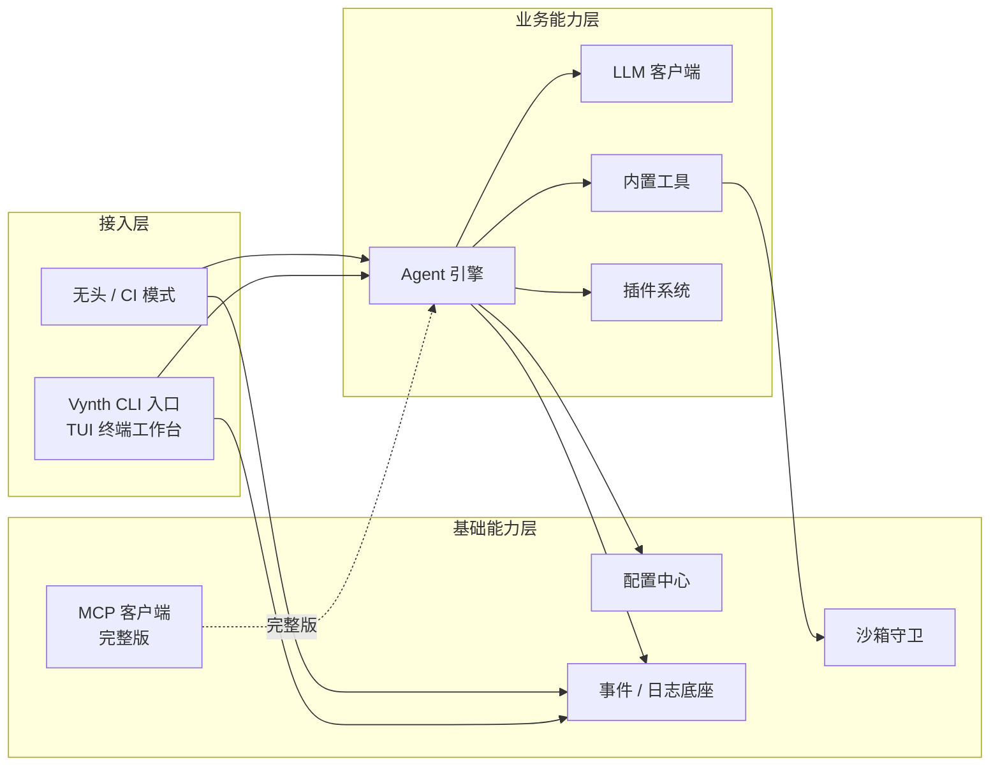

# AICoding 架构设计 · 高层架构设计

> 本文档为《AICoding 架构设计》核心产物之一，对应**高层架构设计模版**。本文档为下游《系统设计》《部署设计》《安全设计》《UserStory》的唯一边界基线。
>
> 上游输入：用户原始诉求（vibe coding TUI 终端编程工具，类比 Claude Code/OpenCode/Codex）+ material_digest.md v0.1（G1 通过）+ research_report.md v0.1（G2 通过）；
> 下游输出：驱动《系统设计》《部署设计》《安全设计》《UserStory》四份文档。

---

## 0. 元信息：修订记录

> 记录文档版本、变更内容、修订人、修订时间，确保设计文档的可追溯。

```yaml
标题: Vynth - 高层架构设计 v0.1
版本: v0.1
状态: Draft   # Draft | Reviewing | Approved | Deprecated
创建日期: 2026-07-24
最后更新: 2026-07-24
作者: 业务架构师（xu / 许边界）
评审人:
  - team-lead（主理人）
  - 用户（G3 人工审核）

关联文档:
  上游输入:
    - 业务原始诉求 / PRD: 由主理人注入（vibe coding TUI 终端编程工具，类比 Claude Code/OpenCode/Codex）
    - 行业调研报告: /Users/zfkc/Desktop/04-AI/vynth/.workbuddy/output/research_report.md
    - 项目资料摘要: /Users/zfkc/Desktop/04-AI/vynth/.workbuddy/output/material_digest.md
  下游产出:
    - 系统设计: AICoding架构设计-2-系统设计.md
    - 部署设计: AICoding架构设计-3-部署设计.md
    - 安全设计: AICoding架构设计-4-安全设计.md
    - UserStory: AICoding架构设计-5-UserStory.md
```

| 版本 | 日期 | 作者 | 变更内容 | 评审状态 |
| --- | --- | --- | --- | --- |
| v0.1 | 2026-07-24 | 业务架构师（xu） | 初稿（G3 高层架构边界冻结） | Draft |

> **版本管理纪律**：破坏性变更（章节结构调整 / 关键决策反转）升 MAJOR；新增章节、扩充内容升 MINOR。

---

## 1. 需求概要

### 1.1 需求概要说明

Vynth 是本地优先、单二进制的 vibe coding TUI 终端编程工具（类比 Claude Code / OpenCode / Codex）。当前 v0.1.0 已实现 agent loop、内置工具、demo、插件无头接入与自研 ANSI TUI，但存在 sandbox 无硬隔离、MCP 未接入 CLI、单二进制体积 61MB 超标、配置仅环境变量致合规缺口等短板。本期由“补齐安全与生态短板、冻结能力边界、明确 MVP / 完整版演进”驱动，对 Vynth 做高层架构边界冻结，作为下游系统设计 / 部署 / 安全 / UserStory 的唯一上游基线。

### 1.2 关键决策摘要

| 编号 | 决策类别 | 决策内容 | 关联章节 |
| --- | --- | --- | --- |
| D1 | 范围决策 | 本期聚焦本地优先单二进制形态，MCP CLI 接入、TUI 内插件、配置文件、联网 OS 级硬隔离推迟至完整版 | §6.1 需求边界 |
| D2 | 技术选型决策 | 沿用纯 TS 单二进制 + 自研 ANSI TUI + OpenAI 兼容 SSE + 插件无头底座，不引入云后端 / 厂商锁定模型 | §4.2 / §3 |
| D3 | MVP / 完整版边界 | MVP = 单二进制 TUI + agent loop + 内置工具 + demo + 插件无头；完整版补充 MCP CLI、TUI 插件、配置合规层、OS 级沙箱 | §4.3 |
| D4 | 默认值裁决（经决策冻结） | 默认 LLM 端点 / 模型以代码为准统一为 DeepSeek（`https://api.deepseek.com/v1` + `deepseek-chat`），文档向代码对齐 | §4.2（解决 X1 / X2） |
| D5 | 复用 vs 新建 | 复用现有 `@vynth/*` 包底座（core / engine / tui / sandbox / mcp / plugins）；sandbox 硬隔离与配置合规层为完整版新建 | §5.2 |

### 1.3 价值主张

| 价值维度 | 量化目标 | 度量指标 | 当前值 | 目标值 | 截止时间 |
| --- | --- | --- | --- | --- | --- |
| 成本 | 默认模型单任务 token 成本低于主流闭源 SaaS | 单任务平均 token 成本（USD） | 未测（基准为 GPT-4o-mini 类） | ≤ DeepSeek 默认，较 GPT-4o 类降 ≥80%（假设：事实为 DeepSeek 定价显著低于闭源 SaaS） | MVP 上线 |
| 效率 | 冷启动到可用会话时长保持低位 | 冷启动 P95 | ~100ms（D52） | ≤150ms | MVP 上线 |
| 体验 | 无 API Key 首次启动即可进入 demo 体验 | 无 Key 进入 demo 率 | 已实现（D22） | 100%（无 Key 自动切换 EchoProvider） | MVP 上线 |
| 合规 | 关键危险操作策略可审计覆盖 | 审计覆盖率（run_shell / 插件加载） | 0% | 100% 策略留痕 | 完整版 |
| 成本 | 单二进制分发体积压降至目标区间 | 单二进制体积（MB） | 61（D52 / D53 / D54） | ≤40 | 完整版 |

---

## 2. 需求分析 & 痛点解构

### 2.1 甲方决策者 / 最终用户 / 受影响方 的核心角色关注点

> 三类核心角色（甲方决策者、最终用户、受影响方）的关注点按下列子节盘点，覆盖决策者、终端用户与受影响方各维度；同类角色合并呈现，确保 ≥3 类核心角色均可独立识别。

#### 2.1.1 甲方决策者角色关注点

| 角色 | 业务身份 | 主要操作 | Top1 关心点 | 来源 |
| --- | --- | --- | --- | --- |
| 甲方决策者（产品 / 技术负责人） | Vynth 团队负责人 | 范围裁决 / 路线图 / 资源投入 | ROI 与合规可控：本地优先无锁定、分发成本可控、安全短板是否兜底 | D0 / D48 / D54 |

#### 2.1.2 最终用户角色关注点

| 角色 | 业务身份 | 主要操作 | Top1 关心点 | 来源 |
| --- | --- | --- | --- | --- |
| 最终用户 A（终端开发者 - TUI 交互） | 本地开发者 | 启动 TUI、输入 goal、审阅流式补全与工具执行 | 流式渲染不卡顿、核心路径 ≤3 步启动会话 | D1 / D28 / D48 |
| 最终用户 B（自动化 / CI 使用者 - 无头模式） | DevOps / 脚本 | `-g` 无头执行、管道集成、插件加载 | 无头模式稳定、退出码语义明确、可脚本化 | D10 / D51 / D54 |

#### 2.1.3 受影响方角色关注点

| 角色 | 业务身份 | 主要操作 | Top1 关心点 | 来源 |
| --- | --- | --- | --- | --- |
| 受影响方：企业安全 / 合规 reviewer | 安全 / 合规 reviewer | 审计配置、评估数据驻留与泄露面 | 危险操作（读 SSH key / 联网）有策略与留痕 | D34 / D53 / D54 / R-01 |
| 受影响方：插件开发者 | 第三方 / 内部插件作者 | 编写 / 加载插件（`-p`） | 插件契约清晰、信任边界明确、宿主权限可控 | D42 / D51 / D53 |

### 2.2 核心痛点

| 编号 | 痛点描述 | 现象 / 数据 | 影响角色 | 影响程度 | 优先级 |
| --- | --- | --- | --- | --- | --- |
| P1 | sandbox 无进程 / 网络硬隔离，`run_shell` 以宿主权限运行，危险操作可越权 | 设计信任模型，无 OS 级隔离；`VYNTH_NET` 仅为软开关（D34 / D53 / D54）；AI coding agent “致命三要素”命中（私密数据 + 不可信内容 + 对外通信，SR-23） | 企业安全 / 合规、终端开发者 | 高（数据泄露 / 合规） | P1 |
| P2 | MCP 未并入 CLI，扩展生态弱于 MCP-first 竞品 | `McpClient` 已就绪但未接入 agent 工具集（D38 / D49）；Claude Code / Gemini CLI 均 MCP-first（SR-01 / SR-14） | 终端开发者、插件开发者 | 中 | P2 |
| P3 | 单二进制体积超标（61MB vs 目标 20–40MB） | 当前约 61MB，含 react 残留（D52 / D53 / D54） | 分发 / 终端开发者 | 中 | P2 |
| P4 | 仅环境变量配置，无配置审计轨迹，企业合规缺口 | 不读取配置文件（D14），R-03 中风险 | 企业安全 / 合规 | 中 | P2 |
| P5 | 默认 LLM 端点文档与代码不一致，用户混淆 | 文档写 OpenAI，代码默认 DeepSeek（X1 / X2），R-05 | 终端开发者 | 低-中 | P2 |

### 2.3 期待目标

| 编号 | 目标描述 | 对齐痛点 | 度量指标 | 当前值 | 目标值 | 截止时间 |
| --- | --- | --- | --- | --- | --- | --- |
| V1 | MVP 维持设计信任模型并文档化已知局限；完整版引入 OS 级沙箱 + 插件沙箱化 + 硬网关 | P1 | 高危操作策略覆盖 / 数据泄露面 | 软开关 | 完整版实现进程 + 网络硬隔离 | 完整版 |
| V2 | MCP 接入 CLI agent 工具集，对齐 MCP 稳定协议 | P2 | 已接入 MCP 工具数 | 0（未并入） | ≥1 标准 MCP Server 可调用 | 完整版 |
| V3 | 单二进制体积压降至目标区间 | P3 | 单二进制体积（MB） | 61 | ≤40 | 完整版 |
| V4 | 关键危险操作可审计（策略 + 留痕） | P4 | 审计覆盖率 | 0% | `run_shell` / 插件加载 100% 留痕 | 完整版 |
| V5 | 默认 LLM 端点文档与代码统一 | P5 | 文档 / 代码一致性 | 不一致 | 100% 文档对齐代码（DeepSeek） | MVP 上线 |

### 2.4 基线复用

| 复用类别 | 现有能力 | 复用方式 | 来源系统 | 备注 |
| --- | --- | --- | --- | --- |
| 核心底座 | Bun 单二进制 + pnpm workspace + turbo | 直接复用 | Vynth 现有（ADR-0003，D52） | 纯 TypeScript 全量构建 |
| 渲染底座 | 自研轻量 ANSI TUI + stream-escape-hatch | 直接复用 | packages/tui（D28 / D29） | 明确不用 ink / yoga.wasm |
| Agent 底座 | engine：agent-loop（maxSteps=8）+ 内置工具 | 直接复用 | packages/engine（D23 / D24） | — |
| LLM 底座 | OpenAI 兼容 SSE 客户端 + EchoProvider | 直接复用 | packages/engine/llm（D22） | 默认 DeepSeek（D14） |
| 沙箱底座 | sandbox：safeResolve + runCommand（VYNTH_NET 软开关） | 直接复用（完整版增强） | packages/sandbox（D34） | 符号链接越界已修复（X4） |
| 插件底座 | plugins loader（`-p/--plugin` 无头接入） | 直接复用 | packages/plugins（D42 / D51） | 已实现（X3） |
| MCP 底座 | McpClient（stdio JSON-RPC） | 复用（待接入 CLI） | packages/mcp（D38） | 未并入 CLI（R-04） |
| 配置 / 主题 | 仅环境变量 + Catppuccin 主题 | 直接复用 | core/config（D14）/ tui/theme（D30） | 7 环境变量 |

### 2.5 功能缺口

| 阶段 | 功能缺口 | 必要性 | 优先级 | 对齐目标 |
| --- | --- | --- | --- | --- |
| 事前（启动 / 接入） | 默认 LLM 端点文档对齐代码（DeepSeek） | 必须 | MVP | V5 |
| 事中（编程会话） | agent loop + 内置工具（read / write / shell）稳定运行 | 必须 | MVP | — |
| 事中 | 自研 ANSI TUI 双模式（Plan / Vibe）+ 主题 | 必须 | MVP | — |
| 事中 | demo EchoProvider 无 Key 离线体验 | 必须 | MVP | — |
| 事中 | 插件无头接入（`-p`） | 重要 | MVP | — |
| 事后（安全 / 合规） | OS 级沙箱（进程 + 网络硬隔离） | 重要 | 完整版 | V1 |
| 事后 | 关键操作审计留痕 | 重要 | 完整版 | V4 |
| 运营（扩展） | MCP CLI 接入 | 重要 | 完整版 | V2 |
| 运营 | TUI 内插件加载 | 可选 | 完整版 | — |
| 运营 | 配置合规层（可选配置文件 + 审计） | 可选 | 完整版 | V4 |

---

## 3. 行业调研

### 3.1 行业标杆系统分析

| 标杆系统 | 厂商 / 来源 | 场景覆盖 | 技术亮点 | 商业模式 | 适用度 |
| --- | --- | --- | --- | --- | --- |
| Claude Code | Anthropic（闭源 SaaS + 本地 CLI 客户端） | 终端自主编程 Agent | agentic loop / 6 级权限 / CLAUDE.md / 上下文压缩 / Ink TUI / 沙箱 | 订阅 / API（闭源） | 中（闭源云模型） |
| OpenCode | Anomaly 社区（开源 MIT） | 模型中立终端 Agent | TypeScript + Effect.ts / Provider 无关 / Plan-Build 双模式 / MCP / LSP | 免费开源（自备 Key） | 高（最契合） |
| Aider | Paul Gauthier（开源 Apache 2.0） | 终端结对编程（git-diff） | repo-map（tree-sitter）/ Architect 双模型 / Git 审计轨迹 | 免费开源（付 token） | 高 |
| Codex CLI | OpenAI（开源 Apache 2.0） | 终端轻量 coding agent / 沙箱 | 三档审批 / apply_patch / Seatbelt-Docker 沙箱 / MCP | 免费开源（付 OpenAI） | 中 |
| Gemini CLI | Google（开源 Apache 2.0） | 终端 AI Agent / 1M 上下文 | MCP-first / 多层沙箱 / Headless JSON / GEMINI.md | 免费 OAuth + 付费 API | 中 |
| Vynth（自研） | vynth 团队 | vibe coding TUI | 自研 ANSI + 逃生舱 / OpenAI 兼容 SSE / Plan-Vibe / 插件无头 | 自研（默认 DeepSeek） | 基准 |

### 3.2 方案对标及优先级打分

| 评估维度 | 权重 | Claude Code | OpenCode | Aider | Codex CLI | Gemini CLI |
| --- | --- | --- | --- | --- | --- | --- |
| 场景契合度 | 0.30 | 5 | 5 | 4 | 4 | 4 |
| 技术成熟度 | 0.20 | 5 | 4 | 5 | 4 | 4 |
| 集成难度（反向） | 0.15 | 3 | 5 | 3 | 3 | 4 |
| 成本（反向） | 0.15 | 2 | 5 | 5 | 3 | 4 |
| 合规可控性 | 0.20 | 2 | 5 | 5 | 3 | 3 |
| **加权总分** | **1.00** | **3.65** | **4.80** | **4.40** | **3.50** | **3.80** |

**结论摘要**：

- **优先借鉴**：**OpenCode（4.80）** 与 **Aider（4.40）**。理由：二者均为开源、本地优先、模型中立 / Provider 无关、无供应商锁定，在成本与合规可控性维度均得满分，与 Vynth“本地优先 + 单二进制 + 可自托管”定位高度一致；OpenCode 的 TypeScript + Plan-Build 双模式 + Provider 抽象层与 Vynth 技术栈最贴近，Aider 的 repo-map 上下文工程与 Git 审计轨迹是补充借鉴点。
- **部分借鉴**：**Claude Code（3.65）**、**Gemini CLI（3.80）**、**Codex CLI（3.50）**。借鉴点：Claude Code 的 agent-loop / Plan 模式 / 6 级权限 / 上下文压缩 / 流式 TUI 范式、开源沙箱（bubblewrap / seatbelt）思路；Gemini CLI 的 MCP-first、Headless JSON、多层沙箱矩阵、GEMINI.md；Codex CLI 的审批模式分级、apply_patch、Seatbelt-Docker 沙箱、OpenTelemetry 审计日志。
- **不借鉴（否决）**：以“闭源云后端 + 厂商锁定模型”作为 Vynth 的默认交付形态。理由：B1 / B4 / B5 的 SaaS 默认路径在合规可控性（B1=2、B4=3、B5=3）与成本（B1=2）维度显著偏低，与 Vynth“本地优先 + 单二进制 + 可自托管 + Provider 无关（默认 DeepSeek）”的项目定位直接冲突（D1 / D14 / D48）。

### 3.3 完整报告参考

- 完整报告链接：`/Users/zfkc/Desktop/04-AI/vynth/.workbuddy/output/research_report.md`
- 调研工具：`tech-research-advisor`（见附录 B）
- 调研日期：2026-07-24
- 调研归档：`/Users/zfkc/Desktop/04-AI/vynth/.workbuddy/output/research_report.md`

---

## 4. 方案决策

### 4.1 价值定位澄清

```
对外价值（客户侧）：为终端开发者提供本地优先、零依赖分发、模型中立的 vibe coding 体验，首次启动即可离线 demo，单二进制即装即用。
对内价值（运营侧）：研发侧复用纯 TypeScript 单二进制底座，零云成本、零供应商锁定；运营侧通过开源生态与插件无头扩展降低维护成本；管理侧以设计信任模型 + 完整版 OS 级沙箱兜底安全。
差异化价值        ：相对 Claude Code / Codex CLI / Gemini CLI 的闭源云模型默认路径，Vynth 默认 DeepSeek + OpenAI 兼容 SSE，本地优先单二进制、无数据出本地（默认），可自托管 / 多 provider。
```

**与产品矩阵的关系**：本系统在“本地优先终端编程工具”矩阵中承担核心 Agent 引擎职责，与上游 LLM Provider、下游 sandbox / MCP / 插件形成完整业务闭环（见 §5.2、§5.3）。

### 4.2 系统定位澄清

| 维度 | 内容 |
| --- | --- |
| 系统名称 | Vynth（vibe coding TUI 终端编程工具） |
| 系统类型 | 已有系统扩展（v0.1.0 演进） |
| 部署形态 | 本地优先单二进制（Bun `bun build --compile`），非 SaaS / 非私有化服务集群；经决策冻结 |
| 多租户 | 否（本地单用户单二进制，不适用多租户）；经决策冻结 |
| 服务对象 | 终端开发者（TUI）、自动化与 CI 使用者（无头）、插件开发者、企业安全合规 reviewer |
| 上游依赖 | LLM Provider（OpenAI 兼容 SSE，默认 DeepSeek）、MCP Server（完整版） |
| 下游消费者 | 宿主文件系统、Shell、插件进程、sandbox 执行环境 |
| 边界（不做） | 不做云端后端、不做厂商锁定模型默认、不做多租户 SaaS、不做 IDE 插件市场（完整版另议） |

**待裁决冲突冻结（X1 / X2 / X3 / X4 / X5）**：

| 冲突 | 裁决 | 证据 |
| --- | --- | --- |
| X1：默认 LLM 端点 | 以代码为准冻结为 `https://api.deepseek.com/v1` | `packages/core/src/config.ts`（D14） |
| X2：默认模型 | 以代码为准冻结为 `deepseek-chat` | `packages/core/src/config.ts`（D14） |
| X3：插件 `--plugin` CLI 加载 | 已接入无头模式，packages.md 描述滞后 | `apps/cli/src/main.ts`（D10）、`docs/api/overview.md`（D51） |
| X4：sandbox 符号链接越界 | 已修复，README 注释为陈旧描述 | `packages/sandbox/src/sandbox.ts`（D34）、`docs/release-notes-v0.1.0.md`（D54） |
| X5：workspace 声明口径 | pnpm workspace + turbo 为实际机制，双声明并存属历史兼容 | `pnpm-workspace.yaml`（D3）、根 `package.json`（D2） |

> X6（README 环境变量清单不全）与 X7（单二进制体积 60 vs 61MB）为文档口径差异，非事实矛盾，已在 §6.1 / 附录 C 中标注。

### 4.3 MVP 与完整版决策

| 阶段 | 时间窗 | 范围（功能编号） | 架构差异点 | 退出标准 | 不做（延后） |
| --- | --- | --- | --- | --- | --- |
| MVP | W1 ~ W6 | F1 ~ F11（单二进制 TUI / agent loop / 内置工具 / demo / 插件无头 / 双模式主题 / 默认 DeepSeek 对齐 / 无 Key demo / 帮助与退出码 / 越界守卫） | 设计信任模型（软 `VYNTH_NET`）、仅环境变量、无 OS 沙箱、MCP 未接入 | 跑通核心会话 + 无头管道 + 退出码语义；单二进制可用；demo 即开 | F12 MCP CLI / F13 TUI 内插件 / F14 配置合规层 / F15 OS 级沙箱 |
| 完整版 | W7 ~ W14 | + F12 ~ F15 | 引入 OS 级沙箱（bubblewrap / seatbelt）+ 插件沙箱化 + `VYNTH_NET` 硬网关 + 可选配置审计层 + MCP CLI 接入 | DAU / 管道稳定 30 天 + 高危操作 100% 策略留痕 + 单二进制体积 ≤40MB | — |

> **注**：MVP 是否引入 OS 级沙箱硬隔离（F15）已触发中间确认（见 §4.3 后 / 附录 C）。当前表格采用**推荐项**：OS 级沙箱推迟至完整版，MVP 维持设计信任模型（软 `VYNTH_NET`）并文档化已知局限。待用户回注后定稿该子项。

**演进纪律**：

- ✅ MVP 的架构骨架必须是完整版的子集，不允许 MVP 上线后推倒重来。本方案中 MVP 的“单二进制 + TUI + agent loop + 内置工具 + 插件无头”骨架在完整版中保持不变。
- ✅ MVP 中可 Mock / 简化的能力（如 MCP 未接入、无 OS 沙箱）在完整版有明确替换计划，见 F12 / F15。
- ❌ 禁止：MVP 为了赶工而引入“完整版无法继承”的临时架构（如临时单库 → 完整版分库分表）。

---

## 5. 业务架构设计

### 5.1 业务架构图

> 三层业务架构图：接入层（用户 / 触点）→ 业务能力层（核心模块）→ 基础能力层（底座 / 数据）。由 `diagrams-generator` 技能生成（Graphviz），输出 PNG / SVG 并已内嵌。


*图：Vynth 三层业务架构图（接入层 → 业务能力层 → 基础能力层）。实线表示同步调用 / 主链路；虚线表示异步事件 / 外部依赖 / 完整版能力。来源：`diagrams-generator` 生成的 Graphviz 图，源文件位于 `pic/业务架构图/business_architecture.dot`。*

### 5.2 系统依赖架构

| 依赖类型 | 系统 / 模块 | 提供方 | 依赖能力 | 接入方式 | 同步 / 异步 | 关键约束 |
| --- | --- | --- | --- | --- | --- | --- |
| 上游 | LLM Provider（OpenAI 兼容 SSE） | DeepSeek / OpenAI / 自建 | chat / tool_calls 流式 | HTTPS SSE | 同步（流式） | 拒绝向非 localhost 明文 http 发送 API Key（D22 `assertSafeEndpoint`） |
| 上游 | MCP Server（完整版） | 社区 / 自建 | tools/list、tools/call | stdio JSON-RPC | 同步 | protocolVersion `2024-11-05`（D38），完整版可升级至 2025-11-25（U-05） |
| 下游 | 宿主文件系统 | OS | read / write / run_shell | 进程内（sandbox） | 同步 | safeResolve 越界拒绝 + symlink 二次校验（X4 已修复） |
| 下游 | 宿主 Shell | OS | run_shell | `spawn sh -c` | 同步 | `VYNTH_NET` 软开关；默认 30s 超时 SIGKILL（D34） |
| 复用底座 | `@vynth/core` | 自研 | config / events / logger / errors | 进程内 import | 同步 | 仅环境变量（D14） |
| 复用底座 | `@vynth/tui` | 自研 | ANSI 渲染 + 逃生舱 | 进程内 | 同步 | TTY raw mode（D28） |
| 复用底座 | `@vynth/plugins` | 自研 | `-p` 动态 import 加载 | 进程内 `import()` | 同步 | 信任边界：宿主完整权限（D53） |
| 数据订阅 | 无外部数据订阅 | — | — | — | — | 本地单二进制，不依赖外部数据平台 |

> **P1 痛点对应的核心能力来源**：P1（sandbox 无硬隔离）对应能力来源为自研 `@vynth/sandbox`（MVP 软隔离）+ 完整版新建 OS 级沙箱（bubblewrap / seatbelt）。

### 5.3 业务闭环

**业务主链路**（端到端）：

```
用户启动（TUI / 无头）→ loadConfig（环境变量，默认 DeepSeek）→ startTui / runHeadless → runAgent（agent loop，maxSteps=8）→ LLM 流式补全（token / tool）→ 工具调用（read / write / shell 经 sandbox）→ 结果回填 → 流式渲染（TUI / 逃生舱直写）→ 会话完成（done）→ 反馈回路
```

**关键反馈回路**：

| 回路 | 触发点 | 反馈对象 | 反馈机制 | 价值 |
| --- | --- | --- | --- | --- |
| 业务效果回路 | 会话 / 任务完成 | 用户（下一轮 goal）/ 项目记忆（完整版） | 本地会话历史 / 可选项目记忆文件 | 优化下一轮交互与上下文 |
| 运营监控回路 | 高危操作（`run_shell` / 插件）/ 异常退出 | 安全 / 合规 reviewer（完整版审计） | 策略留痕 + 告警（完整版） | 快速响应风险 |
| 模型迭代回路 | 用户反馈 / 失败任务 | Provider 选择 / Prompt（`DEFAULT_SYSTEM`） | 切换模型 / 调优 system prompt | 提升任务成功率 |

**运营主线**：

- 每日：终端开发者在本地会话中复用 demo / 真实模型；遇到安全敏感操作时依赖 `VYNTH_NET` 软开关与越界守卫。
- 每周：维护团队根据 release-notes 复盘已知局限（sandbox 软隔离、MCP 未接入、体积）与修复计划。
- 每月：安全 / 合规 reviewer 评估高危操作审计覆盖率，决定是否启动 OS 级沙箱、配置合规层等完整版能力。

---

## 6. 产品需求及原型

### 6.1 需求边界

### 6.1.1 In-Scope（本期必做）

```
F1. 单二进制分发（Bun compile，本地优先）
F2. 自研 ANSI TUI + 流式逃生舱（非 ink）
F3. Plan / Vibe 双模式 + Catppuccin 主题（mocha / latte）
F4. agent loop（maxSteps=8）+ 内置工具（read_file / write_file / run_shell）
F5. OpenAI 兼容 SSE LLM 客户端 + 默认 DeepSeek 对齐
F6. demo EchoProvider 无 API Key 离线体验
F7. 插件无头接入（-p / --plugin）
F8. 退出码语义（0 / 2 / 非 0）+ 帮助 / 版本
F9. sandbox 越界守卫（safeResolve + symlink 二次校验）
N1. 冷启动 P95 ≤ 150ms
N2. 单二进制体积：MVP 维持 ≤ 61MB 并启动优化，完整版目标 ≤ 40MB
N3. 仅环境变量配置体系（7 变量）
```

### 6.1.2 Out-of-Scope（生态与体验延后）
| 编号 | 不做的事 | 原因 | 后续计划 |
| --- | --- | --- | --- |
| O1 | MCP CLI 接入 | `McpClient` 已就绪但未并入 CLI，生态补强非 MVP 阻塞（D38 / D49 / R-04） | 完整版（F12） |
| O2 | TUI 内插件加载 | 信任模型联动未定，当前仅无头模式（D54 / D-04） | 完整版（F13） |
| O6 | 预编译发行包 / 插件市场 / 自动更新 | 分发简化优先，v0.1.0 范围边界明确排除（D54） | 后续版本另议 |

### 6.1.3 Out-of-Scope（安全与合规延后）
| 编号 | 不做的事 | 原因 | 后续计划 |
| --- | --- | --- | --- |
| O3 | 配置文件 / 配置合规审计层 | ADR-0003 明确仅环境变量；企业合规需补（R-03） | 完整版（F14） |
| O4 | OS 级沙箱（进程 + 网络硬隔离） | 跨平台成本（macOS / Linux / Windows），不阻塞 MVP（R-01 / U-03）；已触发中间确认 | 完整版（F15），待用户回注后定稿 |

### 6.1.4 Out-of-Scope（定位排除）
| 编号 | 不做的事 | 原因 | 后续计划 |
| --- | --- | --- | --- |
| O5 | 多租户 SaaS / 云端后端 | 与本地优先单二进制定位冲突，用户诉求未要求（D0 / D48） | 不做（定位决议） |

### 6.2 产品模块全景图



| 字段 | 说明 |
| --- | --- |
| 模块名称 | 标准名 |
| 一级归属 | 接入层 / 业务能力层 / 基础能力层 |
| 责任团队 | 团队名 |
| 上游 | 模块 / 系统列表 |
| 下游 | 模块 / 系统列表 |
| MVP 是否包含 | 是 / 否 |

| 模块名称 | 一级归属 | 责任团队 | 上游 | 下游 | MVP 是否包含 |
| --- | --- | --- | --- | --- | --- |
| Vynth CLI 入口（apps/cli） | 接入层 | 客户端工程 | core / engine / tui / plugins | TUI / 无头渲染 | 是 |
| TUI 渲染层（packages/tui） | 接入层 | 客户端工程 | engine（StreamEvent） | 终端 stdout | 是 |
| 无头模式（apps/cli runHeadless） | 接入层 | 客户端工程 | engine / plugins | stdout 管道 | 是 |
| Agent 引擎（packages/engine） | 业务能力层 | Agent 工程 | LLM / sandbox / tools | TUI / 无头 | 是 |
| LLM 客户端（packages/engine/llm） | 业务能力层 | Agent 工程 | LLM Provider | agent-loop | 是 |
| 内置工具（packages/engine/tools） | 业务能力层 | Agent 工程 | sandbox | agent-loop | 是 |
| 插件系统（packages/plugins） | 业务能力层 | 扩展工程 | engine（tools registry） | 宿主 import | 是（无头） |
| 配置中心（packages/core/config） | 基础能力层 | 平台工程 | 环境变量 | 全局 | 是 |
| 沙箱守卫（packages/sandbox） | 基础能力层 | 安全工程 | OS fs / shell | 工具执行 | 是（软隔离） |
| 事件 / 日志底座（packages/core） | 基础能力层 | 平台工程 | — | 全局 | 是 |
| MCP 客户端（packages/mcp） | 基础能力层 | 扩展工程 | MCP Server | agent（完整版） | 否 |

### 6.3 功能清单

| 编号 | 一级模块 | 二级功能 | 功能描述 | 优先级 | MVP 范围 | 完整版范围 | 对齐目标 |
| --- | --- | --- | --- | --- | --- | --- | --- |
| F1 | CLI 入口 | 单二进制启动 | Bun compile 单二进制；`--version` / `--help` | P0 | ✅ | ✅ | — |
| F2 | TUI 渲染 | ANSI 渲染 + 逃生舱 | 自研 ANSI，高频 token 直写，非 ink | P0 | ✅ | ✅ | — |
| F3 | TUI 渲染 | 双模式 + 主题 | Plan / Vibe + mocha / latte | P0 | ✅ | ✅ | — |
| F4 | Agent 引擎 | agent loop | maxSteps=8，token / tool 事件循环 | P0 | ✅ | ✅ | — |
| F5 | 内置工具 | read / write / shell | 经 sandbox 执行 | P0 | ✅ | ✅ | — |
| F6 | LLM 客户端 | OpenAI 兼容 SSE | 流式 chat / tool_calls 聚合 | P0 | ✅ | ✅ | — |
| F7 | LLM 客户端 | 默认 DeepSeek 对齐 | 代码为准，文档统一 | P0 | ✅ | ✅ | V5 |
| F8 | LLM 客户端 | demo EchoProvider | 无 Key 离线 | P0 | ✅ | ✅ | — |
| F9 | 插件系统 | 无头插件接入 | `-p/--plugin` 加载并激活 | P0 | ✅ | ✅ | — |
| F10 | 沙箱守卫 | 越界守卫 | safeResolve + symlink 校验 | P0 | ✅ | ✅ | V1（部分） |
| F11 | CLI 入口 | 退出码 / 帮助 | 0 / 2 / 非 0 语义 | P0 | ✅ | ✅ | — |
| F12 | MCP 客户端 | CLI 接入 | `McpClient` 并入 agent 工具集 | P1 | ❌ | ✅ | V2 |
| F13 | 插件系统 | TUI 内插件 | TUI 加载（信任模型联动） | P2 | ❌ | ✅ | — |
| F14 | 配置中心 | 配置合规层 | 可选配置文件 + 审计 | P2 | ❌ | ✅ | V4 |
| F15 | 沙箱守卫 | OS 级硬隔离 | bubblewrap / seatbelt + 硬网关 | P1 | ❌（待中间确认） | ✅ | V1 |

**范围说明**：所有 P0 级功能（F1–F11）均在 MVP 范围内标记为 ✅，即 **P0 ＝ MVP**；P1 / P2 功能中仅 F10（越界守卫）纳入 MVP，其余延后至完整版（含 F12–F15）。

### 6.4 产品原型 - TUI 终端工作台

**核心页面清单**：

| 页面 | 用途 | 关键交互 | MVP |
| --- | --- | --- | --- |
| 主交互屏 | 流式补全 + 工具回显 | 输入 goal / Enter 提交；StreamArea 直写；Ctrl-C 退出 | ✅ |
| 帮助屏 | 用法 + 环境变量 | `-h/--help` 触发；打印退出码与 7 个环境变量 | ✅ |
| 主题切换 | mocha / latte 切换 | `VYNTH_THEME` 环境变量；`draw()` 重新调色板 | ✅ |
| 无头插件加载（参数触发） | `-p` 工具注入 | 通过命令行参数指定插件路径，无头模式执行 | ✅ |

**关键交互约束**：

- 启动到可用会话：冷启动 P95 ≤ 150ms（对齐 V1 效率目标）。
- 核心路径：启动 → 输入 goal → 审阅流式结果，操作步数 ≤ 3 步。
- 流式渲染：token 到终端呈现走 StreamArea 行内直写，避免 React 全树重渲染（D29）。

**原型链接**：暂无（本阶段为高层架构，原型由下游 product-story-designer 细化）。

### 6.5 产品原型 - 无头 / CI 模式

**核心页面清单**：

| 页面 | 用途 | 关键交互 | MVP |
| --- | --- | --- | --- |
| 无头执行 | `-g` 目标管道 | 标准输出流式 token / tool；退出码 0 / 2 / 非 0 | ✅ |
| 插件无头 | `-g -p` 插件 | 动态加载插件并注册工具，管道化输出 | ✅ |
| 退出码 | 脚本判断 | 0 正常 / 2 用法错误 / 非 0 运行期错误 | ✅ |

**原型链接**：暂无（本阶段为高层架构，原型由下游 product-story-designer 细化）。

---

## 附录 A：生成流程方法论

> 本附录为高层架构设计的生成方法论，描述每一步的目标、工具与产物形态，作为正文章节的产出依据。

| 步骤 | 名称 | 核心产出 | 落入正文章节 |
| --- | --- | --- | --- |
| Step0 | 业务基础知识库构建 | 关联文档结构化知识库 | （为全文提供输入） |
| Step1 | 行业调研分析 | 行业标杆 / 方案对比 / MVP 决策 | §3 行业调研 |
| Step2 | 需求分析 / 痛点解构 | 需求画像卡 | §2 需求分析 & 痛点解构 |
| Step3 | 能力盘点，系统定位 | 价值定位 + 系统定位 | §4 方案决策 / §5.2 系统依赖架构 |
| Step4 | 生成系统高层架构设计 | 本文档主文档 | §1 ~ §5 |
| Step5 | 产品需求及原型 | 需求边界 + 全景图 + 原型 | §6 产品需求及原型 |


---

## 附录 B：配套工具清单

### B.1 知识库 Skill

- `docx`
- `pdf`
- `pptx`
- `xlsx`

> 本项目资料均为文本型（`.ts` / `.md` / `.json` / `.yaml`），未调用二进制 Office / PDF Skill。

### B.2 行业调研

- `tech-research-advisor`

### B.3 图表生成

- `diagrams-generator`：生成三层业务架构图（本附录 C 给出生成记录）。

---

## 附录 C：中间确认自检报告与生成记录

> 依据 `skills/aicoding-team-bootstrap/protocols/intermediate_confirmation.md` §2.1 + §2.3，在 §2、§4、§5、§6 关键章节完成后完成自检。本附录记录所有自检结论与已触发 / 未触发确认项。

### C.1 自检点：§2 系统定位与对外承诺（部署形态 / 多租户）

- **§2.1 判定**：未命中。部署形态与多租户结论由用户原始诉求（“终端编程工具”指向本地优先）+ 项目事实（Bun 单二进制，D52 / D53 / D54）+ 调研结论（否决闭源云后端锁定，research_report.md §3.2）共同确定，无 ≥2 种合理分歧需用户裁决。
- **§2.3 反向验证 3 问**：
  - **Q1 返工成本**：若推翻本地优先单二进制，需重写 §4.2、§5.2、§6.1、§6.2，并重新设计部署与分发；切换成本 ≈ 2 人以上周。但用户诉求与代码事实均指向本地优先，推翻概率极低，当前结论的证据已明确。
  - **Q2 用户感知**：用户可见。终端工具是本地安装还是 SaaS 直接影响产品形态。但冻结为本地优先与“终端编程工具”一致，不造成用户感知偏差。
  - **Q3 与诉求一致**：一致。用户原始诉求原文：“vibe coding TUI 终端编程工具，类似 Claude Code、OpenCode、Codex 终端编程工具”。Claude Code / OpenCode / Codex 均为本地优先终端工具，本地优先单二进制与诉求一致。
- **结论**：未命中，不发起确认；冻结部署形态为本地优先单二进制，多租户为“否”。

### C.2 自检点：§4 MVP 与完整版决策 - 沙箱 / 安全模型范围（已触发中间确认）

- **§2.1 判定**：命中。当前决策点存在 ≥2 种合理方案：
  - 方案 A（推荐）：MVP 维持设计信任模型（软 `VYNTH_NET`），文档化已知局限，OS 级硬隔离推迟至完整版。
  - 方案 B：MVP 即引入 OS 级沙箱（bubblewrap / seatbelt / gVisor），实现进程 + 网络硬隔离。
  两种方案均有合理性：方案 A 与当前代码状态、调研 MVP 建议、快速交付一致；方案 B 与 R-01 高优先级安全风险和 Claude Code / Codex / Gemini CLI 行业实践一致。该决策直接影响 security-architect 与 platform-architect 的产出（沙箱设计、跨平台可行性、信任边界），且用户原始诉求未明确选择该具体决策点。
- **§2.2 判定**：命中。该决策跨越 合规 / 对外承诺 边界（安全等级、隐私保护方式）与 用户可见行为 边界（高危操作是否默认被硬隔离）。
- **§2.3 反向验证 3 问**：
  - **Q1 返工成本**：若推翻沙箱范围，需重写 §4.3、§5.2、§6.1、§6.3 的相关行，并重新规划 security-architect / platform-architect 的下游设计。切换成本 ≈ 2–4 周（sandbox 包增强 + 跨平台适配），≥ 0.5 人月，属于“返工范围显著”。
  - **Q2 用户感知**：可感知。企业安全 / 合规 reviewer 会关注高危操作（`run_shell` / 插件）是否有 OS 级硬隔离；终端开发者也会感知安全等级与信任边界（如是否需要每次确认、是否允许联网）。
  - **Q3 与诉求一致**：诉求原文未显式提及沙箱，但“类似 Claude Code / OpenCode / Codex”中，Claude Code 与 Codex 已提供 OS 级沙箱。方案 A（MVP 无硬隔离）与“类似标杆”的**完全能力**不一致，但与用户诉求未明示的“MVP 先可用”形态一致；因此需要用户确认。
- **结论**：命中，已发起 `[中间确认]`，当前 §4.3 / §6.1 / §6.3 采用推荐项（方案 A），待用户回注后定稿。

### C.3 自检点：§5 三层业务架构图与业务闭环

- **§2.1 判定**：未命中。三层业务架构图（接入层 → 业务能力层 → 基础能力层）由模板硬性要求，且项目已有 `@vynth/*` 包结构可直接映射；业务闭环主链路 + 反馈回路按项目现有数据流（D49）绘制，无方案分歧。
- **§2.3 反向验证 3 问**：
  - **Q1 返工成本**：若推翻三层分层，需重绘 §5.1 图与重写 §5.2 / §6.2 模块归属；切换成本 ≈ 0.5 天（文档重排），不涉及工程实现。
  - **Q2 用户感知**：用户不可直接感知三层架构图本身；它只影响下游系统 / 平台 / 安全设计的模块划分。若模块归属错误，下游可能产生接口不一致，但可通过文档同步修正。
  - **Q3 与诉求一致**：一致。用户诉求要求终端编程工具，其天然可分为终端接入、Agent 核心、底座三层，与 Vynth 现有包结构（D49）一致。
- **结论**：未命中，不发起确认。

### C.4 自检点：§6 In-Scope / Out-of-Scope 边界与功能清单

- **§2.1 判定**：未命中。In-Scope / Out-of-Scope 由用户诉求 + 项目现状（v0.1.0 已实现项）+ 调研 MVP 建议（research_report.md §4.2）共同确定；唯一开放项（F15 OS 级沙箱）已单独触发 §C.2 中间确认。无其他方案分歧。
- **§2.3 反向验证 3 问**：
  - **Q1 返工成本**：若推翻某功能优先级，仅需重写 §6.3 行与 §4.3 范围表；切换成本 ≈ 1 人天（文档），不涉及工程实现。
  - **Q2 用户感知**：用户可感知功能是否提供（如 MCP CLI）。但当前范围（MCP 推迟）与项目现状一致，未改变现有可感知形态；F15 已单独确认。
  - **Q3 与诉求一致**：一致。用户诉求未显式要求 MCP、配置文件、OS 级沙箱；核心要求“终端编程工具”由 F1–F11 覆盖。
- **结论**：未命中，不发起确认。

### C.5 图表生成记录

- 工具：Graphviz（`dot`）
- 源文件：`/Users/zfkc/Desktop/04-AI/vynth/.workbuddy/output/pic/业务架构图/business_architecture.dot`
- 输出文件：
  - `business_architecture.png`
  - `business_architecture.svg`
- 生成命令：
  ```bash
  dot -Tpng business_architecture.dot -o business_architecture.png
  dot -Tsvg business_architecture.dot -o business_architecture.svg
  ```
- 字体：PingFang SC（macOS 系统字体，支持 CJK）
- 校验：已生成 PNG / SVG 双格式，文件大小分别为 459KB / 20KB，图中三层结构、中文标签、数据流标注清晰可读。

---

## 附录 D：资料与调研继承关系

| 文档 | 来源 | 在本文档中的使用方式 | 章节 |
| --- | --- | --- | --- |
| 用户原始诉求 | 主理人注入 | 定义系统定位与价值边界 | §1.1 / §4.2 |
| material_digest.md | knowledge-ingest-engineer（wen） | 事实源：包结构、代码默认值、实现状态、冲突 X1–X7 | §2.4 / §4.2 / §5.2 |
| research_report.md | research-analyst（查有据） | 证据：标杆分析、加权矩阵、风险、建议、U-03 / U-05 待确认项 | §3 / §4.3 / §6.1 |
