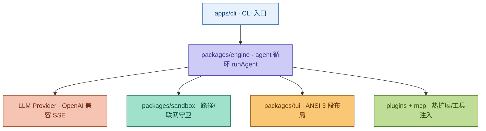

# 架构总览

> Zeno —— 你 terminal 里的代码合成器（AI-Native Coding Terminal）。纯 TypeScript 全量构建，单二进制分发。
> 设计决策：纯 TypeScript 全量构建（`bun build --compile` 单二进制分发）。

## 一句话架构

**自然语言目标（goal）→ agent 循环 → LLM 流式补全（OpenAI 兼容 SSE）→ 工具调用（tool call）→ 沙箱执行（sandbox）→ TUI / 无头流式渲染**。

整个系统以 `@zeno/*` 包组织，由 `bun build --compile` 打包为单个 `dist/zeno` 二进制，运行于 Bun 运行时。

## 系统架构图



## 运行形态（双模式）

| 模式 | 触发方式 | 行为 |
|------|----------|------|
| **TUI（交互）** | `zeno`（需真实 TTY） | 轻量 ANSI 全屏界面，逐字符流式 + 工具调用回显 |
| **Headless（无头）** | `zeno -g '<目标>'` | 跳过 TUI，agent 结果直接流式输出到 stdout |

两种形态共用同一条 `agent-loop`：区别只在最后「渲染」环节——TUI 走 `StreamArea` 直写逃生舱，无头走 `process.stdout.write`。

## Package 地图

> 路径前缀均为仓库根；包作用域为 `@zeno/*`。依赖关系来自各 `package.json`。

| 包 | 路径 | 职责 | 关键依赖 |
|----|------|------|----------|
| `@zeno/core` | `packages/core` | 共享类型、配置加载、错误体系、事件总线（Emitter）、日志 | 无（叶子包） |
| `@zeno/engine` | `packages/engine` | LLM 客户端（OpenAI 兼容 SSE）、工具注册表、agent 循环（合并原 llm+tools+agent） | `core`, `sandbox` |
| `@zeno/tui` | `packages/tui` | 轻量 ANSI TUI（非 ink）、Catppuccin 主题、流式逃生舱 | `core`, `engine`, `ansi-escapes` |
| `@zeno/sandbox` | `packages/sandbox` | fs 越界守卫、命令执行隔离、网络开关 | `core` |
| `@zeno/mcp` | `packages/mcp` | stdio JSON-RPC 的 MCP 客户端（initialize / tools/list / tools/call） | `core` |
| `@zeno/plugins` | `packages/plugins` | 插件 manifest 加载（`import()` 动态加载）与生命周期（activate） | `core`, `engine` |
| `@zeno/harness` | `packages/harness` | e2e 集成测试（bun:test 驱动 agent 循环） | `core`, `engine` |
| `@zeno/cli` | `apps/cli` | CLI 入口（bin: `zeno`），参数解析、模式分发 | `core`, `engine`, `tui` |

> 实现状态：`apps/cli/main.ts` 打通 `core + engine + tui`（内置工具 `read_file`/`write_file`/`run_shell`）；**plugins 经 `-p/--plugin` 接入**（无头直接加载，TUI 弹信任确认）；**MCP 经 `-s/--mcp` 接入**（stdio JSON-RPC，工具自动并入 agent 工具集），详见 [API 总览](../api/overview.md)。

## 数据流（端到端）

```
            ┌──────────────────────── 交互入口 ────────────────────────┐
            │  zeno (TUI, 需 TTY)        zeno -g '<goal>' (无头)      │
            └───────────────────────────┬─────────────────────────────┘
                                         │  goal (string) + loadConfig()
                                         ▼
            ┌─────────────────────────── agent-loop ───────────────────────────┐
            │  runAgent(goal):                                                  │
            │   1. 组装 messages = [system, user(goal)]                          │
            │   2. 取 toolDefs = tools.list()                                   │
            │   3. for step in 0..maxSteps(默认 8):                             │
            │        - provider.chat(messages, toolDefs) → AsyncIterable<StreamEvent>
            │        - 收集 token / pendingTool                                 │
            │        - 若 pendingTool: tools.run(name, args) → ToolResult       │
            │        - 回填 messages: [assistant, tool]                         │
            └───────┬───────────────────────────────┬──────────────────────────┘
                    │ StreamEvent {token|tool|done}  │ tool call
                    ▼                                ▼
        ┌─────────────── LLM 层 ──────────────┐   ┌────────── sandbox ──────────┐
        │ createProvider(config):             │   │ readText / writeText:        │
        │  - 有 key → OpenAiProvider           │   │   safeResolve 越界守卫        │
        │    fetch POST {baseUrl}/chat/completions │ runCommand(sh -c):          │
        │    SSE 逐行解析 → token / tool_calls │   │   网络开关(networkAllowed)   │
        │  - 无 key → 抛出 LlmError            │   │   超时 30s(SIGKILL)          │
        └─────────────────────────────────────┘   └─────────────────────────────┘
                    │                                │ ToolResult {ok,output,error}
                    └───────────────┬────────────────┘
                                    ▼
                        ┌────────── 渲染层 ──────────┐
                        │ TUI:  StreamArea 直写逃生舱  │
                        │       (全屏重绘 + 行内覆盖)  │
                        │ 无头: process.stdout.write   │
                        └──────────────────────────────┘
```

### 关键不变量（Invariants）

- **StreamEvent 是唯一跨层协议**：`engine` 向 `tui` / `cli` 只暴露 `StreamEvent`（`token` / `tool` / `done`），渲染层与上层解耦。
- **工具结果统一为 `ToolResult`**：`{ ok, output, error? }`；失败不抛异常，而是 `ok:false` 回灌 `messages`，由 LLM 决定下一步。
- **沙箱是工具执行的唯一出口**：所有 fs / shell 访问经 `sandbox` 的 `safeResolve` 越界守卫与网络开关，agent 不能直接触达宿主机任意路径。
- **无 key 即失败**：`createProvider` 在 `apiKey` 为空时抛出 `LlmError`，要求显式配置 `ZENO_API_KEY`。

## 构建与分发

```bash
bun install                 # 或 pnpm install（pnpm-workspace.yaml）
bun run compile             # → dist/zeno 单二进制（bun build --compile）
./dist/zeno --help
```

- 包管理：`pnpm workspace` + `turbo`（`build`/`test`/`lint` 依赖图见 `turbo.json`）。
- 类型检查：`tsconfig.base.json`（target ES2022，strict，Bundler 解析）。
- 测试：`bun test`（harness 包提供 agent 循环 e2e 用例）。
