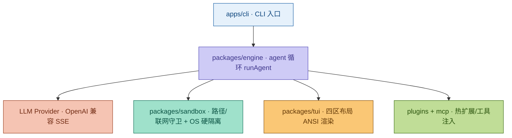

# Zeno 文档中心

> **Terminal-first AI coding agent** —— 本地优先的单二进制 TUI AI 编程工具。

## 30 秒安装

```bash
# macOS / Linux
curl -fsSL https://raw.githubusercontent.com/Agions/vynth/main/scripts/install.sh | bash

# Windows PowerShell
irm https://raw.githubusercontent.com/Agions/vynth/main/scripts/install.ps1 | iex
```

## 架构速览

自然语言目标（goal）→ `engine` 的 agent 循环 → LLM 流式补全 → 工具调用 → `sandbox` 执行 → TUI / 无头渲染，整条链由 `bun build --compile` 打包为单二进制。



> 模块职责、端到端数据流与关键不变量见 [架构总览](architecture/index.md)。

## 文档导航

### 🚀 上手（新用户，15 分钟）

| 文档 | 内容 |
| --- | --- |
| [安装指南](guide/installation.md) | 快捷脚本 / 源码构建 / 二进制分发 · 平台支持矩阵 |
| [快速开始](guide/getting-started.md) | API Key 配置、首次运行、插件与 MCP |
| [TUI 使用指南](guide/tui.md) | 四区布局、全套快捷键、斜杠命令、主题 |

### ⚙️ 日常使用（30 分钟）

| 文档 | 内容 |
| --- | --- |
| [配置详解](guide/configuration.md) | 三级优先级、环境变量、配置文件、安全开关 |
| [API 参考](api/overview.md) | CLI 参数、退出码、错误码体系 |
| [插件开发](guide/plugins.md) | manifest、生命周期、工具注册、信任模型 |
| [FAQ](faq/index.md) | 常见问题与故障排查 |

### 🔧 深度参与（贡献者，2 小时+）

| 文档 | 内容 |
| --- | --- |
| [架构总览](architecture/index.md) | 模块关系、数据流、关键不变量 |
| [Package 职责](architecture/packages.md) | 各 `@zeno/*` 包职责与关键文件 |
| [数据流](architecture/data-flow.md) | 事件流与状态管理 |
| [开发规范](development/dev-guide.md) | 分支模型、代码规范、安全红线 |
| [贡献指南](development/contributing.md) | 提交流程、PR 规范、评审标准 |
| [测试指南](development/testing.md) | 测试策略、基准测试、覆盖率 |

## 核心特性一览

| 特性 | 说明 |
| --- | --- |
| 单二进制 | ~61 MB，零依赖，`scp` 即部署，冷启动 P95 = 30.5 ms |
| 双模式 | Plan（规划 → 分步执行）/ Vibe（流式对话即时改动），`Tab` 切换 |
| 四区 TUI | 聊天主区 + 常驻侧栏 + 分屏输出流 + 浮窗命令面板，帧级差分渲染 |
| 安全体系 | 路径越界守卫 · 联网开关 · OS 硬隔离（Fail-Closed）· 5 维审计 · 插件信任门禁 |
| 可扩展 | 插件热扩展 + MCP 协议（stdio JSON-RPC）接入外部工具 |
| 6 套主题 | truecolor 输出，老终端自动降级 256 色 |

## 版本

- **当前版本**：v0.1.1
- **变更日志**：[v0.1.1](changelog/v0.1.1.md) | [v0.1.0](changelog/v0.1.0.md)

## 贡献

发现文档问题？欢迎提交 [Issue](https://github.com/Agions/vynth/issues) 或 [PR](https://github.com/Agions/vynth/pulls)。
